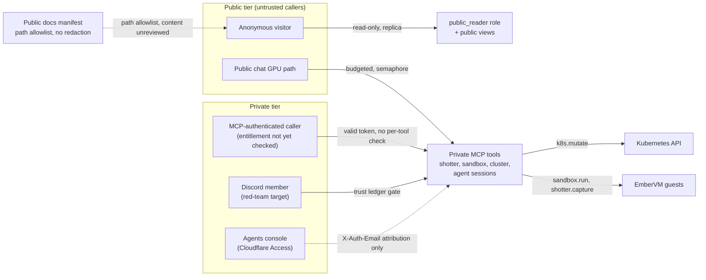

# Monolith Threat Model

_@ 34d4f1816_

STPA-Sec evaluation of the monolith's public and agent-facing surfaces: an
adversary who deliberately abuses admitted capability, forges or withholds
identity, or reaches a tool the entitlement model does not yet gate.
Companion to [STPA.md](STPA.md), which covers safety (unsafe control actions
and unsafe feedback from an honest but imperfect system). This document
covers security (the same control structure, attacked on purpose).
Controller and channel names match STPA.md's control structure so the two
documents cross-reference; hazard IDs referenced here (for example
`unrestricted-tool-visibility`, `unredacted-public-doc`) are defined there.

This document is honest about what is not mitigated. Findings reference
GitHub issue numbers, never secrets: no hostnames, bucket names, 1Password
item paths, or node names appear below.

## 1. Scope and trust boundaries

The monolith's control structure crosses ten boundaries where a lower-trust
actor meets a component holding more data, capability, or credential reach
than the actor should have. Every attack in section 4 crosses one of these.

| Boundary | What crosses it | Trust assumption |
| --- | --- | --- |
| Internet to public tier | Anonymous HTTP via Cloudflare Tunnel to the `monolith-public` frontend SSR, backend, and public FaaS functions | Caller fully untrusted. Isolation is a separate artifact with no private code or secrets present (ADR security/004), enforced prod |
| Public tier to private data | `public_reader` role plus `visibility='public'` views on the CNPG read replica | The replica itself is explicitly not a confidentiality boundary; the role and the views are (ADR security/004), enforced prod |
| Anonymous visitor to GPU inference | Turnstile-gated SSR session, server-side budgets, and a reserved-headroom semaphore in front of the shared vLLM endpoint | Caller fully untrusted; cost and blast radius are bounded by an eight-layer stack (ADR security/005), enforced prod |
| Authenticated MCP caller to tools | A bearer authentik token verified by `PrincipalMiddleware` (cached JWKS, #4955) on every stateless-streamable-HTTP message | The middleware authenticates; almost no tool authorizes on the resulting `Principal` (#4569, designed not built), so "holds a valid token" and "is entitled to the private tier" are the same set today |
| Discord user to the bot | A per-(guild, user) trust ledger, three detection lanes, and the feature ACL grant cache | Caller fully untrusted and treated as an active red-team target by design (ADR chat/003); the owner is exempt and unledgered |
| Agents console attribution | The Cloudflare Access lane projects a verified email into `X-Auth-Email`, which the gateway listener strips and resets before either auth filter runs | Unforgeable from outside the cluster, but the header is forwarded by several allowlisted in-cluster senders and only one of them cryptographically binds the claim; the only live consumer reads it for attribution, not authorization |
| Monolith to the Kubernetes API | A `ClusterRole` granting `get`/`list` across many kinds in every namespace and `patch` on ArgoCD Applications | Reachable through the `cluster.mcp` tools with no per-tool entitlement check; the RBAC grant itself carries no secret-reading verbs |
| Monolith to EmberVM sandbox and shotter guests | HTTP dispatch to per-language and screenshot task guests; the guest itself has no network except an optional scratch-Postgres credential | The guest's own isolation is EmberVM's boundary (see `projects/embervm/STPA.md` and `projects/embervm/THREAT-MODEL.md`); this document covers only the monolith-side broker and its own request-shaping |
| Docs/posts publishing pipeline | An exact `git ls-files` allowlist of project/document-kind pairs (README, ARCHITECTURE, STPA, THREAT-MODEL for seven projects, this document included) copied verbatim into the public manifest | The gate is on path only, never content; whatever is committed at an allowlisted path publishes unreviewed for secrets or internal topology |
| Private monolith pod's own egress | Everything the pod's process can reach on the cluster network or the internet | No default-deny egress CiliumNetworkPolicy exists for this chart, only an ingress allowlist (#4628) and an off-by-default token-replay deny; a compromised or tool-steered pod already holds every backend secret |

## 2. Adversaries

**Anonymous internet visitor.** No identity at all. Capability: any public
route, the Turnstile-gated chat, and the public FaaS invocation surface.
Goal: exhaust GPU or database capacity, exfiltrate private data through a
retrieval or routing gap, or find an internal identifier in a published
document.

**Discord member (self-described red-team target).** A real Discord account,
no special privilege. Capability: whatever the bot's tool set exposes,
gated by the trust ledger. Goal: prompt injection, exfiltration probes, and
resource-exhaustion bait against the bot, explicitly invited by the server's
own culture (ADR chat/003).

**Authenticated MCP caller with a valid token but no entitlement.** Holds a
real authentik-issued bearer token (perhaps from a legitimately provisioned
but narrowly scoped identity) and nothing more. Capability: every private
MCP tool, because none of them authorize on the caller's `Principal` yet.
Goal: reach a tool, a data read, or a cluster mutation its issuer never
intended to grant.

**Prompt-injected agent acting through monolith tools.** Not a human
attacker; a legitimate agent session (Discord-triggered, console-triggered,
or MCP-driven) steered by content it processed. Capability: whatever tools
that session's caller can already invoke, shaped by injected content rather
than the operator's intent. Goal: exfiltrate a credential or private render,
corrupt a durable record, or pivot through a tool call the operator never
authored.

**Attacker with read access to the public replica.** Holds or has stolen
`public_reader`-equivalent access, or reads the replica directly outside
the application. Capability: whatever the role and its views actually
scope, which is only correct if every grant migration and every retrieval
query stayed disciplined. Goal: read a private knowledge-graph row through
an over-broad grant or a missing visibility filter.

**Compromised monolith pod (private tier).** Code execution on the private
binary, through a dependency vulnerability, a steered agent tool call, or a
stolen pod credential. Capability: every backend secret in that pod
(database, Discord bot, GitHub, Claude OAuth, AIS stream, Turnstile),
the full `k8s.mutate` RBAC surface, and, absent an egress policy, unbounded
network reach. Goal: escalate from one compromised process to the whole
private tier's blast radius.

## 3. Assets

| Asset | Wanted by |
| --- | --- |
| Private knowledge-graph rows and chat/session content | The replica-read adversary directly; the compromised-pod adversary via full database access |
| Backend secrets (database, Discord, GitHub, Claude OAuth, AIS, Turnstile, optional scratch-Postgres DSN) | The compromised-pod adversary, and any MCP caller who can get a tool to leak its own process environment |
| Cluster mutation capability (ArgoCD sync, broad cluster-wide read) | The unentitled MCP caller and the compromised-pod adversary, via `k8s.mutate` and the read-only `k8s-*` tools |
| Discord trust-ledger integrity (scores, pardons, lockouts) | The Discord red-team adversary, directly or by reaching the `chat_trust_pardon` tool through an unentitled MCP caller |
| Rendered private-tier screenshots (shotter captures) | The unentitled MCP caller and the prompt-injected agent, since a capture of `private.jomcgi.dev` is retained indefinitely at a guessable content-addressed URL |
| Public docs/posts content, including anything committed at an allowlisted path | The anonymous visitor, passively, whenever a committed document names something internal |
| GPU and sandbox compute capacity | The anonymous visitor (chat) and any MCP caller (sandbox, shotter), bounded by budgets that exist for chat but not uniformly for every tool |

## 4. Attack analysis

One table per adversary. Status values: **enforced prod** (armed in the
reference production deployment), **enforced dev** (armed in dev only),
**shipped off** (the code exists, disabled by default everywhere), **designed**
(an ADR or issue decides it, no code yet), **none** (no control exists).

### Anonymous internet visitor

| Control action / feedback attacked | How | Consequence | Current control | Status | Reference |
| --- | --- | --- | --- | --- | --- |
| `route.public` | Issue: reach a private or internal path via the public HTTPRoute or the SSR proxy | Unauthorized read of private data or an internal handler | Public HTTPRoute scopes only the public hostname to public routers; the private binary's routers are absent from the public artifact entirely (ADR security/004) | enforced prod | `public-route-exposes-private-path` |
| `chatpublic.write` | Issue: bypass Turnstile, per-session limits, or the cluster-wide inference cap to write outside `chat_public` or exhaust the shared GPU | Denial of service against Discord, private chat, and agent-platform workloads sharing the same vLLM endpoint | Turnstile-bound session, three nested budgets, and a reserved-headroom semaphore below `max_num_seqs` (ADR security/005) | enforced prod | `public-write-admission-bypass` |
| `grant.public-reader` (indirect) | Issue: a schema-wide grant or a missing `visibility` filter serves a private row through a public route | Direct disclosure of private knowledge-graph content | `public_reader` role plus the `knowledge_public` view is the confidentiality control; a preflight checklist item and a PreToolUse hook catch the table-creation case only | enforced prod (role) / partial (process discipline) | `over-broad-public-grant`, `docs/runbooks/public-tier-checklist.md` item 1 |
| `docs.publish` (read-only) | Issue: read a currently-published project document that names an internal identifier | Disclosure of internal topology (not a credential, but reconnaissance value) | None; the generator gates on path only. `projects/mcp/README.md` is live on the public docs site today and names an in-cluster service hostname for the MCP gateway | none | `unredacted-public-doc`, `docs.publish.providing`, `projects/monolith/knowledge/tools/gen_docs_manifest.py:123` |

### Discord member (self-described red-team target)

| Control action / feedback attacked | How | Consequence | Current control | Status | Reference |
| --- | --- | --- | --- | --- | --- |
| `acl.check` (indirect, via message flood) | Issue: probe the bot with injection, exfiltration, and OOM-bait faster than the ledger can penalize | Wasted attention classifies, replies, and agent runs before the ledger catches up | Three lanes (heuristics, LLM intent, shadow forest) feed one ledger; heuristics enforce instantly and for free (ADR chat/003) | enforced prod | ADR chat/003 |
| `agent.submit` | Issue: coax the bot into an expensive or destructive agent run through social engineering rather than a technical bypass | An agent session with real tool access acts on injected intent | The trust ledger gates whether the bot engages at all; once engaged, the agent session itself has the same unentitled-tool exposure as any MCP caller (see next table) | enforced prod (gate) / see MCP caller table (downstream tools) | ADR chat/003, `unrestricted-tool-visibility` |
| Ledger self-recovery | Suppress: wait out the 20-point/day recovery instead of triggering new heuristics | A locked-out user regains engagement without correction | By design: recovery is a cooling-off, not a ban, and every observation is logged for the forest lane regardless | enforced prod (accepted design) | ADR chat/003 |
| `chat_trust_pardon` (cross-boundary) | Issue: an MCP caller with no Discord-side privilege calls `monolith_chat_trust_pardon` directly, resetting any locked-out user's score and flipping their labels | Silently undoes the ledger's containment of an active red-team session from a different trust boundary entirely | No per-tool entitlement check; any authenticated MCP caller can invoke it | none | `unrestricted-tool-visibility`, `projects/monolith/agent/mcp.py:338` |

### Authenticated MCP caller with a valid token but no entitlement

| Control action / feedback attacked | How | Consequence | Current control | Status | Reference |
| --- | --- | --- | --- | --- | --- |
| `shotter.capture` | Issue: call the screenshot tool for `private.jomcgi.dev` pages the caller has no other way to view | Disclosure of private-tier page content, retained indefinitely at a guessable URL | `PrincipalMiddleware` requires a valid token; nothing scopes which `Principal` may call this tool | none | `unrestricted-tool-visibility`, `shotter.capture.providing`, `projects/monolith/shotter/mcp.py:120` |
| `sandbox.run` | Issue: call `run_code` to spend zero-egress compute, or, when the scratch feature is enabled, reach the in-cluster scratch database | Compute exhaustion always; credentialed database reach when `scratchPostgres.enabled` | No per-tool entitlement check; the sandbox itself is zero-egress except the scratch DSN, which is off in production today | none (authz) / shipped off (scratch feature) | `unrestricted-tool-visibility`, `sandbox-credential-egress`, `projects/monolith/sandbox/mcp.py:14` |
| `k8s.mutate` | Issue: call `k8s_sync_argocd_app` to trigger, prune, or dry-run an ArgoCD sync on any Application, or call the five read-only `k8s-*` tools for cluster-wide pod logs, configmaps, and events | Unreviewed deploy actions and broad cluster reconnaissance from a token that was never meant to reach the cluster surface | No per-tool entitlement check; the delegation seam (#4940) exists but this tool does not consume it | none | `unrestricted-tool-visibility`, `k8s.mutate.providing`, `projects/monolith/cluster/mcp.py:163` |
| `monolith_agent_session_start` / `send` | Issue: start or drive a full agent session, the same capability the private `/agents` console gives an operator | The caller inherits every tool that session can reach, compounding every other row in this table | No per-tool entitlement check; console access itself is gated by Cloudflare Access, but the MCP path to the same engine is not | none | `unrestricted-tool-visibility`, `projects/monolith/agent_sessions/mcp.py:660` |
| `monolith_agent_register_routine_job` / `trigger_job` | Issue: register or immediately trigger a scheduled automation job | Persistent or one-shot unauthorized job execution | No per-tool entitlement check | none | `unrestricted-tool-visibility`, `projects/monolith/agent/mcp.py:219` |

### Prompt-injected agent acting through monolith tools

| Control action / feedback attacked | How | Consequence | Current control | Status | Reference |
| --- | --- | --- | --- | --- | --- |
| `shotter.store` (indirect exfiltration) | Issue: a steered agent captures a private page and shares the returned content-addressed URL out of band | The capture persists indefinitely at a stable URL reachable by anything that can reach the SeaweedFS S3 endpoint and obtain the hash | No expiry policy on stored captures | none | `private-capture-retained`, `shotter.store.wrong-duration`, `projects/monolith/shotter/s3.py:99` |
| `sandbox-dedupe.stale` feedback | Issue: resubmit `run_code` with the same code but different input files within the EmberVM result-cache TTL | The steered agent (or the operator debugging it) silently receives a prior submission's output computed against different files | The Idempotency-Key hashes `(language, code)` only, never the files; shotter had the identical bug and was fixed with a random per-call nonce, a fix this key does not yet apply | built (bug) | `stale-sandbox-result`, `sandbox-dedupe.stale`, `projects/monolith/sandbox/client.py:97` |
| GitHub mutation via an agent-held credential | Issue: a steered agent shapes a GitHub API or push request that a shared credential authorizes regardless of task intent | Cross-repository write with whatever the shared credential can reach | ADR agents/055 (repo-scoped tool mediation) is superseded by ADR agents/059 (Draft), which routes this through the monolith's own delegation-consuming broker, #4946; not confirmed live for every credential class today | designed | ADR agents/055, ADR agents/059 |
| `docs.publish` (indirect) | Issue: a steered agent commits a plausible-looking documentation change that happens to name an internal identifier, which regenerates and republishes automatically | Internal topology reaches the public site with no reviewer prompt beyond an ordinary PR diff | Path allowlist only; no content scan | none | `unredacted-public-doc`, `docs.publish.providing` |

### Attacker with read access to the public replica

| Control action / feedback attacked | How | Consequence | Current control | Status | Reference |
| --- | --- | --- | --- | --- | --- |
| `grant.public-reader` | Issue: `public_reader` is granted `ALL TABLES` on a schema, or a view lacking the visibility filter | Every private row in that schema becomes readable to the public tier | Migration-level grants scoped to the public schemas and `knowledge_public` view; a PreToolUse hook blocks the table-creation case only, everything else relies on review discipline | enforced prod (grants) / partial (process) | `over-broad-public-grant`, `grant.public-reader.providing` |
| Private schema access as `public_reader` | Issue: attempt to select from a private table using the read-only role | Database permission denial | Enforced at the engine level, not application logic; asserted by `public_reader_grants_test.py` | enforced prod | STPA "Not UCAs" |
| Replica mistaken for a confidentiality boundary | Issue: assume the replica's read-only status alone scopes what is visible | A physical standby is a byte-for-byte copy; the role and views are the actual scope | ADR security/004 documents the distinction explicitly and mandates both controls independently | enforced prod | ADR security/004 |

### Compromised monolith pod (private tier)

| Control action / feedback attacked | How | Consequence | Current control | Status | Reference |
| --- | --- | --- | --- | --- | --- |
| Backend secret reach | Issue: read every secret mounted into the pod (database, Discord bot, GitHub, Claude OAuth, AIS, Turnstile) | Full secret-tier compromise from a single process compromise | ADR security/004 split the anonymous public tier out of this blast radius; the private tier's own secret inventory is unchanged by that split | enforced prod (public split) / none (private tier's own secret concentration) | ADR security/004 |
| `k8s.mutate` plus broad cluster read | Issue: use the pod's own service account, no MCP call needed | ArgoCD sync/prune on any Application, cluster-wide pod/log/configmap/event read | Standard `ClusterRole`, no additional pod-identity scoping beyond RBAC itself | enforced prod (RBAC scope) / none (further containment) | `projects/monolith/chart/templates/rbac.yaml` |
| Off-cluster and cluster-wide network egress | Issue: originate arbitrary outbound connections from the compromised process | Reach any in-cluster service or any internet destination, limited only by what the destination itself will accept | No default-deny egress `CiliumNetworkPolicy` exists for this chart; only an ingress allowlist and an off-by-default token-replay deny | none | `projects/monolith/chart/values.yaml:1458` |

## 5. Unmitigated and partially mitigated findings

Ranked by blast radius.

1. **No monolith MCP tool authorizes on the caller's identity.**
   `PrincipalMiddleware` verifies every bearer token, but nothing downstream
   scopes which `Principal` may call `shotter.capture`, `sandbox.run`,
   `k8s_sync_argocd_app`, `monolith_agent_session_start`, or
   `monolith_chat_trust_pardon`. A caller who holds any valid authentik
   token, however narrowly it was meant to be scoped, reaches the same
   tool surface as the operator behind Cloudflare Access. Tracked in
   #4569.
2. **The public docs pipeline publishes committed content verbatim, with
   no content redaction, only a path allowlist.** `projects/mcp/README.md`
   is live on the public docs site today and names an internal cluster
   service hostname for the MCP gateway. The same class of gap applies to
   every README, ARCHITECTURE.md, STPA.md, and THREAT-MODEL.md at an
   allowlisted path, including this document. Tracked in #5275.
3. **The public tier's off-cluster egress lockdown scopes by
   "in-cluster or not," never by destination.** The backend's own
   CiliumNetworkPolicy comment states the intended reach is Postgres
   read/write, vLLM inference, embeddings, and SeaweedFS S3, but the rule
   that implements it (`toEntities: cluster`) allows every in-cluster pod
   endpoint, not just those four. A compromised public-tier pod has
   cluster-wide pod-to-pod reach despite the isolation this control is
   documented as providing. Tracked in #5276.
4. **`run_code`'s dedupe key omits input files.** The Idempotency-Key is
   `(language, code)` only; a resubmission with the same code but
   different files, within the EmberVM result-cache TTL, silently returns
   a stale prior result. Shotter had the identical shape and was fixed
   with a random per-call nonce; this key was not updated the same way.
   No tracking issue beyond the STPA finding itself.
5. **The private monolith pod carries no default-deny egress policy at
   all.** It holds every backend secret and the full `k8s.mutate` RBAC
   surface; a compromise (through any of the findings above, a dependency
   vulnerability, or a stolen pod credential) has open-ended cluster and
   internet reach with nothing at the network layer to contain it.
   Tracked in #5277.
6. **Scratch-Postgres DSN injection breaks `run_code`'s own isolation
   claim for Python whenever the feature is enabled.** The tool's
   docstring advertises "no network at all" unconditionally; the scratch
   feature, when on, silently contradicts that for one language. Low
   priority today only because `scratchPostgres.enabled` is false in
   production.

## 6. What this model does not cover

- **EmberVM guest and hypervisor isolation.** The sandbox and shotter task
  guests' own security model, Firecracker boundary, and egress broker are
  covered in `projects/embervm/STPA.md` and
  `projects/embervm/THREAT-MODEL.md`. This document covers only the
  monolith-side broker that dispatches to them.
- **Discord platform account compromise.** A member's own Discord account
  being taken over is outside the trust ledger's design; the ledger scores
  behavior through whichever account is speaking.
- **The cluster layers below the monolith.** The ingress tunnel, CNI policy
  enforcement outside the monolith's own chart, admission control, and the
  secret operator are the cluster's baseline; `docs/security.md` owns them.
- **Authentik and Kubernetes control-plane compromise.** This analysis
  assumes the identity provider and `kube-apiserver`/`etcd` hold; an
  attacker who already controls either is outside every boundary in
  section 1.
- **Supply chain of the monolith's own image build.** Dependency
  provenance and build-pipeline compromise are not analyzed here.
- **Cluster-wide capacity exhaustion outside the modeled admission and
  budget gates.** Denial of service via resource pressure elsewhere in the
  cluster is not analyzed here.

## 7. Maintenance

Regenerate this document by hand when a control in section 4 changes
status, the same trigger STPA.md uses for its own refresh. Stamp the
commit as a line under the H1 (`@ <short sha>`), never inside the H1
itself, since the docs site strips it from page titles.
