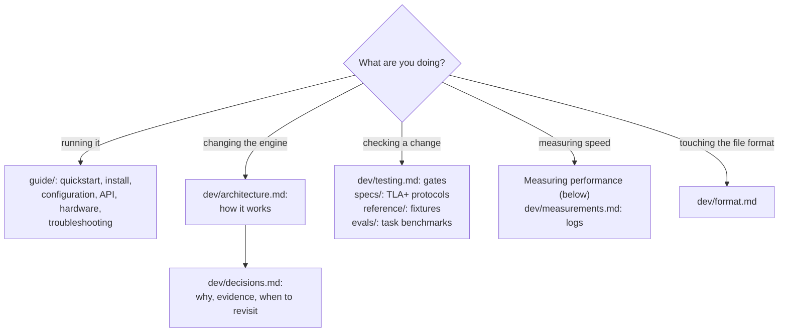

# Contributing to oom-inference

How the project is laid out, how to build and test it, how to measure it, and
where each kind of document lives. Users who only want to run the engine start
at the [guide](../guide/quickstart.md).

## Which document do I need?

| Document                                  | What it holds                                                                                                                                              |
| ----------------------------------------- | ---------------------------------------------------------------------------------------------------------------------------------------------------------- |
| [architecture.md](architecture.md)        | How it works: crates, interfaces, precision, tiers, prefill and decode, sizing, prefix store, speculative decoding, batching, adding a model or a platform |
| [decisions.md](decisions.md)              | One record per design decision: context, decision, evidence (dated measurements), tradeoffs, revisit trigger                                               |
| [measurements.md](measurements.md)        | Dated measurement logs, including the simulated smaller machines                                                                                           |
| [testing.md](testing.md)                  | What each test layer proves, the reference fixtures, the gates and how to run them                                                                         |
| [format.md](format.md)                    | The on-disk weight format (v0)                                                                                                                             |
| [`specs/`](../../specs/README.md)         | TLA+ specs of the tiering protocol and how to model-check them                                                                                             |
| [`reference/`](../../reference/README.md) | Regenerating the reference fixtures from Hugging Face's model code                                                                                         |
| [`evals/`](../../evals/README.md)         | Task benchmarks (GSM8K, RULER, ...) over the OpenAI API                                                                                                    |

## Repository map

| Path                        | What it owns                                                                                                         |
| --------------------------- | -------------------------------------------------------------------------------------------------------------------- |
| `crates/oominf-core`        | Platform- and model-neutral interfaces (`Backend`, `Model`/`Session`, `ExpertSource`)                                |
| `crates/oominf-format`      | The weight format: reader, writer, checksums                                                                         |
| `crates/oominf-convert`     | Release checkpoint to the format, one adapter per model family                                                       |
| `crates/oominf-cuda`        | The CUDA backend; kernels in `kernels/*.cu`, compiled to PTX by `build.rs`                                           |
| `crates/oominf-cpu`         | Routed experts computed on the CPU                                                                                   |
| `crates/oominf-tiers`       | Expert tiers, read paths, memory planning (`plan.rs`, `resources.rs`, `host.rs`)                                     |
| `crates/oominf-models-qwen` | Qwen 3.8 Flash                                                                                                       |
| `crates/oominf-models`      | The model registry                                                                                                   |
| `crates/oominf-server`      | HTTP APIs, chat templates, parsers, sampling, scheduler, prefix store                                                |
| `crates/oominf`             | The `oominf` CLI and composition root (`main.rs`, `load.rs`, `profile.rs`, `doctor.rs`)                              |
| `bench/`                    | `gate.sh` (tier 0 correctness gates), `quality.sh` (tier 1 numerics), `http_bench.py`, `lookup.py`, `make_prompt.py` |
| `specs/`                    | TLA+ specs and `run.sh`                                                                                              |
| `reference/`                | Fixture generator (Python, `uv`)                                                                                     |
| `evals/`                    | Task benchmark harness (Python, `uv`)                                                                                |
| `docs/guide/`               | User documentation                                                                                                   |
| `docs/dev/`                 | This documentation                                                                                                   |
| `docs/figures/`             | `build_figures.py` and the SVGs it writes                                                                            |

## Build and test

The workspace builds with Cargo; it is excluded from the repository's Bazel build
(`.bazelignore`). The toolchain is pinned in `rust-toolchain.toml`, and rustup
installs it on the first `cargo` command. Platform setup is in
[install.md](../guide/install.md).

    cargo build --release          # target/release/oominf
    cargo test --workspace         # CPU tests; GPU tests are #[ignore]d
    cargo fmt --check
    cargo clippy --release --workspace --all-targets

**CPU tests** need no GPU and no CUDA toolkit: without `nvcc` the kernels are
skipped with a build warning and the CUDA backend refuses to start. They cover
the format, converter, cache policies, memory planning, every read path, the
server and its scheduler, and the tier fault-injection tests
([testing.md](testing.md)). They also build and pass on macOS
([install.md](../guide/install.md#macos-development-build-only)).

**GPU tests** are `#[ignore]`d and need a converted model (`OOMINF_MODEL`) and
the reference fixtures. Run them all through the gate:

    bench/gate.sh --model <model.oom> --fixtures <fixtures dir> --lock <lock file>

It builds, runs the CPU tests, the kernel tests, `check-layer` and `check-model`
on the fixtures, and the GPU integration tests (speculative, mtp_lookup,
snapshot, checkpoint, multistream), and ends with `ALL GATES PASSED` or the list
of failures. Every change runs it. Changes that move numerics or drafts also run
`bench/quality.sh` (tier 1, about 30 minutes: `oominf score` against exact
references at 32k and 95k, then GSM8K and RULER samples).

GPU commands (`serve`, `bench`, `tune`, `doctor`, the gates) assume exclusive use
of the device. On a shared machine hold its lock around them
(`flock <lock file> <command>`, or `--lock` for the gate).

Lossy modes are judged by outcome, not by per-layer budgets: compare against the
rounding floor (several equivalent fp32 runs), as [testing.md](testing.md#outcome-scoring-lossy-modes)
explains.

## Measuring performance

Before reporting a speed change:

- **State whether tiers are warm or cold.** The first request after start reads
  experts from disk (cold); later ones find them in VRAM and the host tier
  (warm). Report both or say which. Restarting the server makes tiers cold; the
  page cache may still hold PLE rows.
- **Use fresh prefixes.** The server resumes a request that extends the live
  sequence and restores stored prefixes, so a repeated prompt measures how fast
  the work was skipped. `bench/http_bench.py` gives every run a different topic;
  prefill benchmarks must miss the prefix cache and the prefix store.
- **Take medians of several runs.** Runs vary by a few percent between server
  runs, and two identical concurrency runs differed by 15%. Three warm requests
  per setting is the minimum used for a decision; report the count.
- **A/B by alternating.** Run the two settings in turn on the same machine
  (A, B, A, B), with the same build and the same lock, so drift (thermals, page
  cache, other load) hits both. Rebuild between arms only when the arms are
  builds.
- **Temperature 0 and sampled runs measure different things.** Greedy output is
  repeatable enough to compare acceptance and tokens; sampled output changes
  length and draft acceptance run to run. With `k8v6` and host compute even
  greedy output varies (see [Precision](architecture.md#precision)); use
  `--host-compute 0` when you need identical tokens.
- **Measure through the server for serving claims.** `oominf bench` runs one
  sequence without the server and can hide costs: it reads about 4 records per
  token from disk, which hid the decode lookahead loss
  ([D9](decisions.md#d9-no-decode-lookahead-by-default)).
- **Say which configuration.** Defaults, or the max-perf config
  (`--dense fp8 --expert-precision bf16 --attention-precision bf16`), and the
  context length.
- **Record it.** Put the numbers, date and conditions in the decision record
  they support, or in [measurements.md](measurements.md).

Tools: `oominf bench` (one sequence, tier statistics, `--verify` and `--streams`
for step costs), `bench/http_bench.py` (TTFT and decode through the API,
`--concurrency`), `bench/lookup.py` (prompt-lookup workloads),
`/v1/stats` (counters from a running server; subtract two snapshots).

## Conventions

- Commits follow [Conventional Commits](https://www.conventionalcommits.org/),
  e.g. `perf(oom-inference): ...`.
- No em-dashes anywhere (docs, comments, commits): use a colon, comma,
  parentheses or two sentences.
- A change to a mechanism updates [architecture.md](architecture.md) in the same
  change; a change to a decision updates its record in
  [decisions.md](decisions.md), with the new evidence and its date.
- User-facing changes (a flag, a default, an endpoint, a message) update the
  [guide](../guide/quickstart.md).
- Figures: Mermaid blocks for flows; SVGs only from
  [`docs/figures/build_figures.py`](../figures/build_figures.py) (run it, never
  hand-edit the SVG). SVGs use explicit colors on an opaque light background so
  they read in GitHub's dark mode.
- Check links after moving docs:

      python3 docs/check_links.py
