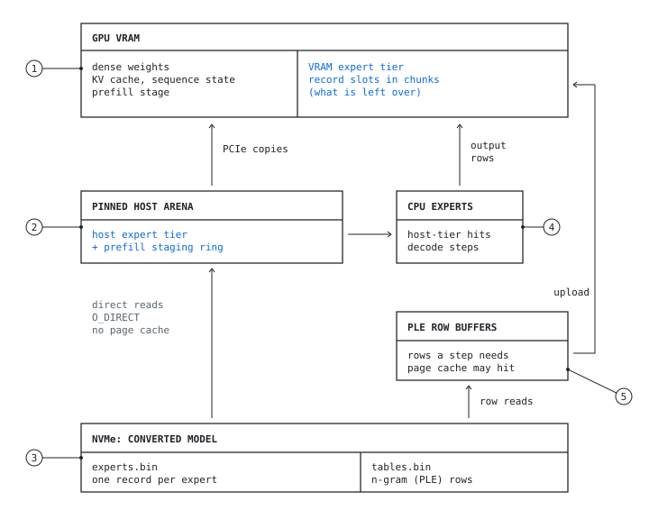
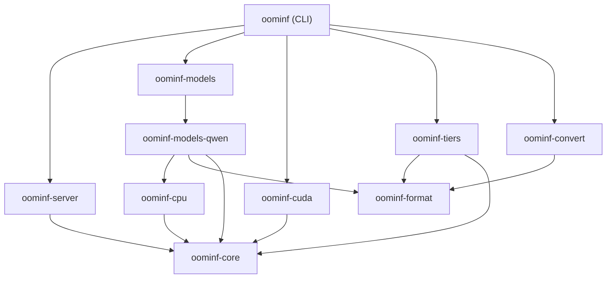
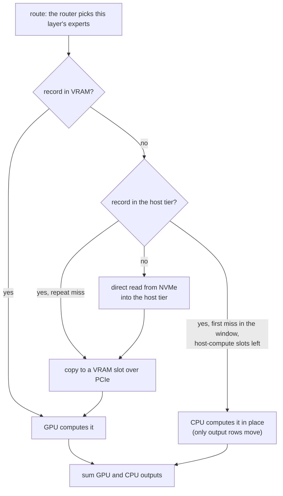
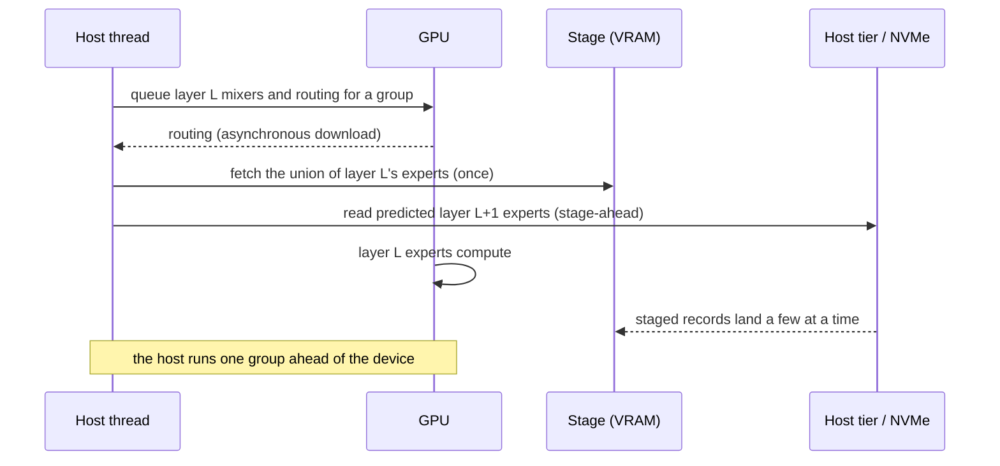
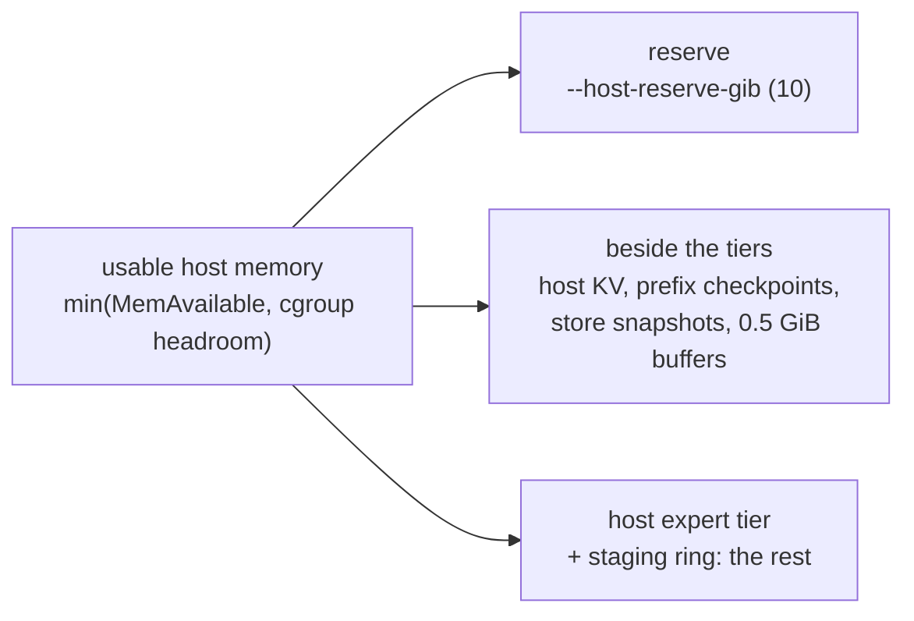
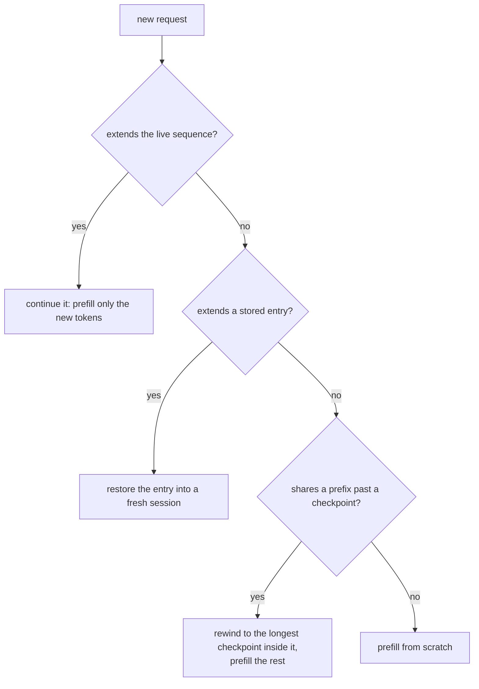
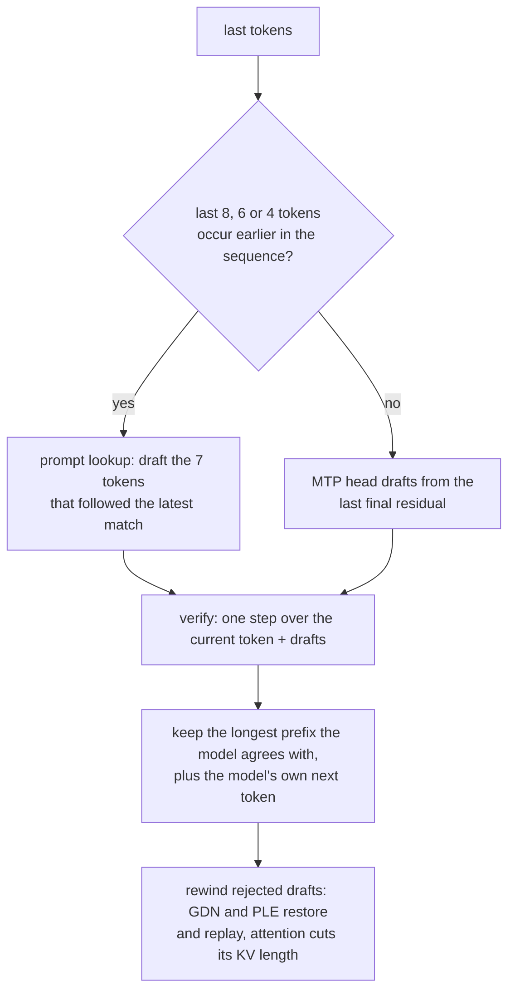
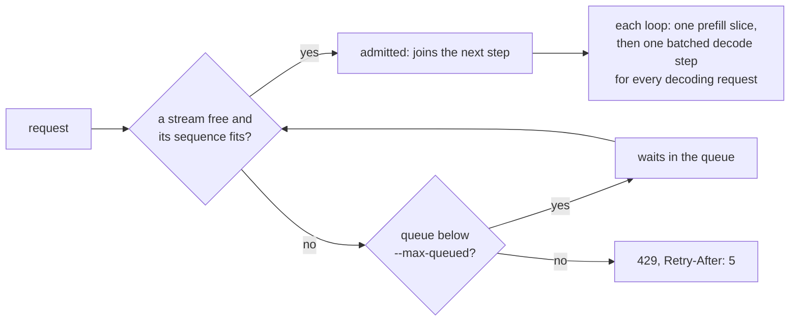

# Architecture

oom-inference serves Mixture-of-Experts models that are larger than GPU memory
plus host memory, on one consumer machine, for a few interactive streams.
Routed experts live in three tiers (VRAM, pinned host memory, NVMe) and move on
demand; everything else stays resident on the device.

This page describes the mechanism. The reasons, with their measurements and
when to reconsider them, are the decision records in
[decisions.md](decisions.md); each section links its records.

| Key | Part                                                                                                                   |
| --- | ---------------------------------------------------------------------------------------------------------------------- |
| 1   | GPU VRAM: dense weights, KV caches and sequence state, the prefill stage, and the VRAM expert tier in whatever is left |
| 2   | Pinned host arena: the host expert tier and the prefill staging ring, filled by direct reads                           |
| 3   | NVMe: the converted model; `experts.bin` holds one record per expert, `tables.bin` the n-gram (PLE) rows               |
| 4   | CPU experts: host-tier hits in decode steps computed in place; only output rows go to the GPU                          |
| 5   | PLE row buffers: only the rows a step needs, read through the page cache and uploaded                                  |

The figure is generated by [`docs/figures/build_figures.py`](../figures/build_figures.py).

## Crates

| Crate                | Role                                                                                                                                                | Depends on               |
| -------------------- | --------------------------------------------------------------------------------------------------------------------------------------------------- | ------------------------ |
| `oominf-core`        | Platform- and model-neutral interfaces: `Backend`, `Model`/`Session`, `ExpertSource`, `Workspace`, `Probe`                                          | nothing in the workspace |
| `oominf-format`      | On-disk weight format: reader, writer, checksums ([format.md](format.md))                                                                           |                          |
| `oominf-convert`     | Release checkpoint (safetensors) to the format, one adapter per model family                                                                        | format                   |
| `oominf-cuda`        | CUDA implementation of `Backend`: device memory, streams, events, cuBLAS, kernels in `kernels/*.cu`                                                 | core                     |
| `oominf-cpu`         | Routed experts computed on the host from records in host memory (exact NVFP4 and bf16 decoding, fp32, AVX-512 with a scalar path), on a worker pool | core                     |
| `oominf-tiers`       | Expert sources: `TieredExperts` (VRAM slots, pinned host arena filled by direct I/O, cache policies) and `DiskExperts`                              | core, format             |
| `oominf-models-qwen` | Qwen 3.8 Flash, generic over `B: Backend`                                                                                                           | core, cpu, format        |
| `oominf-models`      | Registry: opens a converted model with the implementation for its `model_type`                                                                      | core, format, models-*   |
| `oominf-server`      | OpenAI and Anthropic HTTP APIs, chat templates, output parsers, sampling, prefix reuse, continuous batching                                         | core                     |
| `oominf`             | CLI and composition root: picks the backend, the model (via the registry) and the expert source                                                     | all                      |

Only `oominf-cuda` knows about CUDA. Only `oominf-models-*`, the converter's
adapter and the server's output parser know about a model family. The server
runs any `Model`; the CLI is the one place that names the CUDA backend.

Why: [D1: Crate boundaries](decisions.md#d1-crate-boundaries).

## Interfaces

- **`Backend`** (`oominf-core/src/backend.rs`) is a bundle of traits named for
  what models need: `Memory` (typed device buffers, host transfers, raw
  addresses), `Linear` (GEMM/GEMV with fp32 accumulation), `Elementwise`, `Norm`,
  `HyperConnection`, `Recurrent` (convolutions and the gated delta rule with
  carried state), `Attention` (rotary, block-sparse selection, grouped-query
  attention), `Experts` (routing and fused routed-expert compute on quantised
  records read in place), `Lookup` (quantised embedding rows) and `Transfer`
  (a copy queue that runs alongside compute, pinned host memory, events). Model
  code is generic over `B: Backend` and monomorphised: no dynamic dispatch inside
  a step.
- **`Model`** opens sessions; a **`Session`** owns one sequence's state (caches,
  recurrent state) and runs `prefill(tokens)` and `step(tokens)`, returning the
  logits after the last token. For speculative decoding a session may also
  `draft(next, k)` tokens, verify them in one `step_all`, and `rewind` the ones
  the model rejects. `Model::step_many` runs one step over several sessions
  (continuous batching, below). The server, `generate` and `bench` use only
  these.
- **`ExpertSource`** makes a layer's routed experts device-resident and returns
  their record addresses, optionally in two phases so resident experts compute
  while the rest load. Kernels read every part of a record, scales included,
  from that address. An `ExpertFactory` builds the source after the model's
  dense weights and first session state are on the device, so tiers size
  themselves from what is left.
- **`Probe`** observes (and in tests substitutes) named intermediate tensors;
  production passes `NoProbe`.

## Precision

Weights are used exactly as released. Runtime precision is reduced only where
the hardware gains from it, and any such mode is opt-in and must pass the gates
in [testing.md](testing.md). Defaults:

- NVFP4 experts: weights decoded exactly in fp32 (`e2m1 * fp8 * scale_2`),
  activations unquantised (W4A16), fp32 accumulation. Prefill runs them on
  tensor cores without giving that up: `e2m1 * fp8` is an exact bf16 value
  (`scale_2` scales the fp32 result), each fp32 activation splits exactly into
  three bf16 terms, and the products accumulate in fp32.
- Dense weights: bf16 as released. Decode GEMVs read fp32 activations directly;
  prefill GEMMs round activations to bf16 for tensor cores.
- Residual stream, norms, softmax and recurrent state: fp32.
- MTP experts (the draft head): bf16 as released, fp32 activations and
  accumulation.
- KV cache: compressed by default, `k8v6` (`KvFormat::Turbo`: TurboQuant-style
  rotation, then 8-bit keys and 6-bit values from Lloyd-Max codebooks with a
  scale per 32 coordinates); `--kv-cache fp32` keeps it exact. The indexer caches
  stay fp32. Prefill keeps an exact fp32 shadow of the prefilling layer's keys
  and values (one layer at a time, about 0.4 GB at 95k tokens), so prefill
  attention reads fp32 rows instead of re-decoding cached tiles in every block
  and runs at fp32 speed; decode reads the compressed cache.

Four more runtime choices, all off by default:

- `--dense fp8` stores the dense (non-expert) weights as FP8 e4m3, one scale per
  128 weights, quantized on the host at load (routers stay bf16). Prefill
  dequantizes each weight to bf16 once per layer (a 512 MB cache freed when the
  prefill ends).
- `--expert-precision bf16` rounds the prefill expert GEMM's activations to bf16
  (one tensor-core pass, standard W4A16) instead of splitting them into three
  exact bf16 terms. Decode is unaffected.
- `--attention-precision bf16` runs prefill attention on bf16 tensor cores
  (queries, keys and values rounded to bf16, fp32 accumulation and softmax)
  instead of fp32 FMAs; decode attention stays fp32.
- `--kv-placement host` keeps attention K/V caches in host memory the GPU reads
  over PCIe (managed memory preferring the host); the indexer's keys stay on the
  device, so decode reads only each token's selected rows. Results are identical
  to device placement.

Attention follows each query's QSA selection (at most 2,048 keys): decode splits
one token's list over warps, and prefill runs one block per (token, KV head)
over that token's own list. Grouping tokens to share key tiles does not pay:
adjacent tokens share few selected keys (a key in a 4-token group's union is
seen by about 1.2 of them), so shared tiles mostly compute masked-out scores.

Reproducibility: experts computed on the CPU round differently from the GPU, and
which ones run there depends on cache timing. With an exact cache that rarely
changes a token; a compressed cache can turn it into a different codebook index,
so greedy output with `k8v6` varies run to run. With `--host-compute 0` it is
deterministic, and speculative decoding again matches one-token decoding up to
near ties (below).

Why: [D2: Weights exact, lossy modes opt-in](decisions.md#d2-weights-exact-lossy-modes-opt-in),
[D3: k8v6 KV cache by default](decisions.md#d3-k8v6-kv-cache-by-default),
[D4: Speed modes off by default](decisions.md#d4-speed-modes-off-by-default).

## Experts and tiers

- A converted model stores one contiguous record per (layer, expert)
  ([format.md](format.md)), so a miss is one read and one copy.
- **VRAM tier:** record-sized slots in chunked arenas, so whole chunks can be
  given back when a growing KV cache needs memory and taken back for the next
  sequence. **Host tier:** a pinned arena filled with direct (O_DIRECT, io_uring)
  reads, never the page cache, or through the fallbacks of
  [Smaller machines](#smaller-machines) where those are unavailable. **Disk:** the model files.
- Placement is a `Policy` (LRU and decay-weighted frequency), chosen by replaying
  recorded routing traces (`oominf-tiers/examples/replay.rs`).
- Groups with different record layouts (the decoder layers' NVFP4 experts, the
  MTP layer's bf16 experts) get separate tiers behind one source. A small group
  gets one VRAM chunk and has its records read into the host tier at start-up:
  measured on the MTP experts, more device slots barely shorten drafting while
  every slot taken from the main tiers costs decode hits.

Why: [D5: An explicit pinned host tier](decisions.md#d5-an-explicit-pinned-host-tier).

### A decode step

- **Host compute** (decode-sized steps): a record that misses VRAM but is in the
  host tier can stay there and run on the CPU (up to `--host-compute` experts
  per layer), overlapping the GPU's resident experts; only its output rows move.
  Admission to VRAM is second-hit: a key's first host-tier miss within a window
  runs on the CPU, a repeat is copied to VRAM, so one-off experts do not evict
  recurring ones.
- With `--lookahead on` (off by default), during decode (and draft verification)
  layer L+1's router applied to layer L's input predicts the next experts, and
  predicted disk misses are read into the host tier. Routing, not prediction,
  decides which experts run.

Why: [D6: Host compute](decisions.md#d6-host-compute),
[D9: No decode lookahead by default](decisions.md#d9-no-decode-lookahead-by-default).

### Prefill

Prefill streams through a one-layer stage instead of evicting decode-hot
experts. It runs layer by layer: a layer's token mixer runs over every chunk,
the union of their routed experts is fetched once and runs as one step (up to
2048 tokens, about 40 per expert, enough for tensor-core tiles), and the next
layer's experts are staged while the rest of this layer computes (stage-ahead).

- The next layer's experts are predicted by its router on each group (stacked
  with this layer's router, so the prediction arrives with the routing; the
  first group opens the batch, later groups add what their tokens route to) and
  staged while the rest of this layer computes, borrowing the main tier's
  coldest slots while the stage holds the computing layer.
- Staging copies wait only for kernels queued before the computing layer
  started (only those read the slots they overwrite), and their disk reads land
  as they complete. Host-tier staging copies go to the copy engine a few records
  at a time (the next only once those completed) while the host polls for
  routing, so a group's own copies never queue behind the next layer's.
- The host runs one group ahead of the device: a group's mixers and routing are
  queued before the previous group's routing is collected (an asynchronous
  download) and its experts fetched, and small uploads go through pinned
  staging buffers, so neither drains the device's queue.
- Prompts of one chunk skip this: with little compute per layer to hide copies
  behind, the less precise prediction costs more than it saves.
- Prompts longer than 128k tokens, or whose residuals (about 40 KB per token,
  held across layers) do not fit beside the prompt's cache and the expert
  tier's floor, run in the fewest equal windows that fit, each window through
  every layer. Each extra window sweeps every layer's experts through VRAM again
  (about 4.5 s on a 4090).
- With 61 GB of RAM the host tier holds about 40 GB of the 73 GB of experts, so
  a warm prefill still reads about 19 GB from disk; in the later layers those
  reads outlast a layer's compute (#6866).
- Between prefills the stage is a decode victim cache: an evicted record is
  copied there device to device, so a later miss on it is a promotion. When a
  prefill ends, its prefill-only buffers (residuals, KV shadows, fetch-group
  buffers) are freed and the memory is offered back to the expert tier for
  decode.

Why: [D7: Stage-ahead in prefill](decisions.md#d7-stage-ahead-in-prefill),
[D8: Staging copies trickle](decisions.md#d8-staging-copies-trickle).

## Smaller machines

The tiers size themselves on every start from fresh checks, shrink what does not
fit and fail only when the smallest working configuration does not fit
(`oominf-tiers/src/plan.rs`, `resources.rs`; `oominf doctor` prints the result
without starting).

- **Usable host memory** is the smaller of `MemAvailable` and the control
  group's headroom: cgroup v2 `memory.max` or `memory.high`, whichever is lower,
  less the group's use minus its inactive page cache, taking the tightest
  ancestor; cgroup v1 `memory.limit_in_bytes` the same way.
- **Host split.** Usable memory = reserve (`--host-reserve-gib`, default 10) +
  memory beside the tiers + the tiers. Beside the tiers, at the configured
  context and stream count (`HostDemand` from the model, `HostUse` from the
  command): host-placed KV caches per live sequence (`--kv-placement host`),
  prefix checkpoints per live sequence (the planned count at `--max-context`,
  about 0.12 GB each), three prefix-store snapshots when a store is set (one
  being built, one queued, one being written; 0.75 GB each at 32k tokens), and
  a 0.5 GiB allowance for pinned transfer and work buffers. The prefill staging
  ring is part of the tiers' budget.
- **VRAM split** is the same over free VRAM once the model and a first sequence
  are loaded, with `--vram-reserve-gib` (default 2).
- **Shrinking.** A requested size that does not fit is shrunk to what does, with
  a warning naming the figures. No tier is larger than the records its layout
  has. When the result is below the smallest working tiers, a default reserve is
  lowered as far as 3 GiB (host) or 1 GiB (VRAM), keeping as much reserve as
  possible; an explicit reserve is kept. Only then does start-up fail, with the
  needed total itemised.
- **Smallest working tiers** (`min_vram_slots`, `min_host_slots`): VRAM holds the
  largest fetch that does not stream, in 64-record chunks (one chunk beside a
  stage; a whole layer, 512 records, without one); the host tier holds that
  fetch's records too (64 with a stage). For Qwen 3.8 Flash that is 0.2 GiB of
  host tier plus a one-slot ring with a stage, or 1.4 GiB without; the MTP layer's
  minor tier adds 0.6 GiB. Lookahead never pins more host slots than those left
  beyond the minimum, and a fetch that still finds every slot pinned waits for
  the lookahead reads to land.
- **Allocation.** Pinned arenas retry at three quarters of the size down to the
  minimum when mapping or pinning fails. VRAM chunks are kept as far as they
  allocate; the stage is dropped before the main tier would fall below its
  minimum.
- **Reads.** `experts.bin` is read with O_DIRECT through io_uring when both work;
  else O_DIRECT `pread` on a thread pool (io_uring blocked by a seccomp profile or
  missing); else buffered `pread` on a thread pool that drops the read pages from
  the page cache (a filesystem without O_DIRECT). Each start tries a real read on
  each path and logs which one is active; `--io` forces one. Off Linux (a macOS
  development build) only the buffered path exists. The PLE table rows are read
  through io_uring on Linux whatever `--io` says.

Why: [D10: Size from fresh checks, shrink before failing](decisions.md#d10-size-from-fresh-checks-shrink-before-failing).
Measured results under container limits: [measurements.md](measurements.md#simulated-machines-october-6-2026).

## Hardware profile

`serve` measures the machine just before the model loads when no cached
profile matches (`oominf/src/profile.rs`; about a second on the reference
NVMe): scattered and consecutive record reads of `experts.bin` through the
active read path, single-record latency, pinned host-to-device copies, a
one-thread memory copy and the host expert kernel (six experts of a one-token
step on real records). The profile is cached in `$XDG_CACHE_HOME/oominf/` (or
`~/.cache/oominf/`) keyed by GPU name, VRAM, driver, CPU model, usable CPUs
(affinity, so `taskset` counts), RAM, the model's block device and filesystem,
and the engine and probe version; any change measures again. `--no-probe`,
`--reprobe` and `--profile <file>` control it; `oominf tune` measures four times
longer (median of three rounds) and writes it. Safety checks are never cached.

The profile decides only:

- **Host compute off** (`--host-compute 0` by default) when one expert on the CPU
  takes more than 2x a record's PCIe copy: the GPU would wait for the CPU. On the
  reference machine an expert takes 57 us on 8 threads against 103 us to copy its
  2.8 MB record at 26.8 GB/s, so host compute stays on.
- **Prefill staging ring** no larger than the drive fills in 0.5 s (about two
  layers of a long prefill's compute), at least 64 records: slots beyond that
  wait idle, and the memory goes to the host tier. The reference drive (6.9 GB/s)
  fills a whole layer, so the ring stays at 512 records.
- **Warnings** when scattered reads run under 1 GB/s (cold prefill and decode
  misses), reading the dense weights would take over 60 s, or host-to-device
  copies run under 6 GB/s.

A flag on the command line always wins over the profile. Adapting these while
serving (from measured steps, as the step cost curve already is) is not done;
it would hook in at the batched engine's periodic report
(`oominf-server/src/engine/scheduler.rs`).

Why: [D11: The profile decides only two things](decisions.md#d11-the-profile-decides-only-two-things).

## Prefix store

The server keeps the last sequence on the device and resumes a request that
extends it (multi-turn chat, agent loops). With `--prefix-store-dir`, a sequence
evicted from the device (a request that does not extend it, or shutdown) is saved
to disk (`Session::save`: per GDN layer its recurrent and conv state, per
attention layer its cached K/V rows, indexer and block keys, per PLE layer its
conv state and n-gram tokens, the draft head's input row, plus the last logits).
A later request whose prompt extends a saved sequence restores it into a fresh
session instead of prefilling. Entries are verified against their exact token
ids, the checkpoint and KV-format identity and a checksum; the directory is
bounded by a byte budget (least recently used first) and a time to live; host
memory caching comes from the page cache. Saving copies the state to the host on
the engine thread and writes the file on a writer thread.

**Prefix checkpoints.** The GDN layers' recurrent state cannot rewind, so a
sequence alone can only serve prompts that extend all of its tokens. To serve the
same documents with a different question, a prefill keeps checkpoints: the
server plans positions at the starts of the first and last user messages (found
by rendering the template with a marker in that message and matching the token
prefix) and at powers of two from 8k tokens. Layer-major prefill ends a chunk at
each one and copies every GDN and PLE layer's recurrent state on the device as
the layer passes it (about 0.11 GB per checkpoint, counted in the prefill's
memory), then brings the copies to host memory when the prefill ends
(`crates/oominf-models-qwen/src/checkpoint.rs`). A prompt that shares only a
prefix with the live sequence or a stored entry resumes at the longest
checkpoint inside that prefix (`Session::rewind_to`: attention caches are
truncated, recurrent state restored) and prefills only the rest; entries save
their checkpoints with them. Rewinding is exact: a rewound sequence fed a new
continuation matches, bit for bit, one that prefilled just the prefix and then
the continuation (`tests/checkpoint.rs`).

Why: [D12: Prefix store and checkpoints](decisions.md#d12-prefix-store-and-checkpoints).

## Speculative decoding

The checkpoint's multi-token-prediction head drafts the next token from the last
token's final residual; one step then feeds the current token and the drafts,
and `decode_step` (`oominf-core/src/decode.rs`) keeps the longest prefix the
model agrees with, plus the model's own next token. Greedy decoding keeps a
draft only when it is the argmax, so output matches one-token decoding except
where a verify step's different summation order flips a near tie (the
`speculative` test accepts a divergence only where the one-token run's top two
logits are within 0.05, and reports each); sampling
keeps it with the model's probability of it and otherwise samples the model
without it, so output keeps the model's distribution. Rejected drafts are
rewound: GDN and PLE layers restore the step's starting state and replay their
recurrences over the kept rows; attention layers cut their KV length.

Prompt lookup (`PromptLookup`, `serve --prompt-lookup 7`, on by default) drafts
from the sequence itself before asking the model: when the last 8, 6 or 4 tokens
(longest first) occur earlier in the prompt or output, the 7 tokens that followed
their most recent occurrence are verified in one step; otherwise the model
drafts as above. Verification steps of 5 to 16 tokens run on the decode kernels
(GEMVs instantiated for 8 and 16 tokens, FP8 in launches of 8; per-token flash
decode attention), not the prefill ones.

The draft head keeps its own attention cache across calls: entry `p` fuses the
final residual at position `p` with the embedding of the token at `p + 1`, and
each call first appends the entries for the tokens kept since the last call.
Steps drafted by prompt lookup do not call the head, so it falls behind by every
token they keep. The sequence therefore keeps the final residuals of its last
256 positions in a ring (40 KB each, 10 MB) with the tokens that follow them,
and the next model draft catches the head up on every position since its last
call, in steps of four. Only after more than 256 lookup-kept tokens in a row
does the head restart its cache a few positions back. A rewind cuts the ring's
token list; rows of dropped positions are overwritten later.
`tests/mtp_lookup.rs` checks that drafts after lookup runs match drafts made on
every step (it tolerates one near-tie difference in 20 draft tokens).

Why: [D13: MTP speculative decoding](decisions.md#d13-mtp-speculative-decoding),
[D14: Prompt lookup on by default](decisions.md#d14-prompt-lookup-on-by-default),
[D15: Keep residuals across lookup steps](decisions.md#d15-keep-residuals-across-lookup-steps).

## Concurrent requests

`oominf serve --max-streams N` (default 2; 1 serves one request at a time, to
completion) serves up to N requests at once with continuous batching. Requests
beyond those wait in a bounded queue (`--max-queued`, default 16); a request
arriving when the queue is full is refused at once with 429 and `Retry-After: 5`
on both APIs, so sustained overload cannot grow memory (`/v1/stats` reports
`queued` and `rejected`).

- **Batched step** (`Model::step_many`, `QwenModel::step_many`). One step
  carries tokens of several sequences, each with its own KV caches, GDN
  recurrent and conv state, PLE state, draft-head state and position. All
  rows live in one buffer; everything that works row by row runs once over
  all of them (embedding, hyper-connections, the GDN and attention input and
  output projections, the MoE and the head), and only what carries
  per-sequence state runs per sequence on its own rows (PLE, the GDN conv and
  recurrence, the attention core). Each layer therefore routes all rows
  together and fetches the union of their experts once. Each sequence can
  rewind its own rejected drafts afterwards. Sessions are trait objects; the
  model reaches its own sessions' state through `Session::as_any_mut`.
- **Scheduler** (`oominf-server/src/engine/scheduler.rs`). Requests join and
  leave between steps. Each loop runs one prefill slice (the oldest admitted
  request still prefilling) and then one decode step for every decoding
  request. A prompt prefills whole, or in `--prefill-slice` pieces when other
  requests are decoding. Stop tokens, token limits, sampling, events and
  cancellation stay per request; a finished sequence goes to the prefix cache,
  clearing (and so saving to a prefix store) the one it displaces.
- **Admission.** A request is admitted while its sequence, grown to its token
  limit, fits in device memory beside the active sequences grown to theirs
  (`Model::sequence_bytes` against free memory plus what the expert tier can
  give back, less the step headroom); otherwise it queues. A new session takes
  its state's memory from the expert tier (`release_vram`) rather than from the
  step headroom, and batched steps keep that headroom free.
- **Token budget** (`oominf-server/src/budget.rs`). Each step carries every
  decoding stream's next token (worth 1) and the drafts (prompt lookup when it
  matches, else the draft head's) whose expected value pays for the width they
  add: draft j of a stream is worth a^j, a being that stream's recent
  acceptance. The allocator takes candidates by value and picks the width that
  maximises expected tokens per millisecond under a step cost curve
  (`--step-cost`, default measured, refined by every measured step) plus
  the draft head's cost per drafted token, within `--max-step-tokens` (default
  16, the decode GEMV's limit; wider steps run prefill GEMMs). With one
  decoding request the step is exactly the one-request engine's (its
  configured drafts).

Why: [D16: One batched step](decisions.md#d16-one-batched-step),
[D17: Prefills not sliced by default](decisions.md#d17-prefills-not-sliced-by-default).

## Correctness

Every change is checked against the model's reference implementation
([testing.md](testing.md)). Protocols with concurrency (tier staging, slot reuse
and retirement, CUDA graph replay through a slot table) are specified in TLA+
([`specs/`](../../specs/README.md)) and model-checked, including deliberately
broken variants that the invariants must catch.

Why: [D18: Fixed references and checked protocols](decisions.md#d18-fixed-references-and-checked-protocols).

## Adding a model

A new model family touches four places, nothing else:

1. **A model crate** (`crates/oominf-models-<family>`): the model written against
   `B: Backend`, implementing `Model`/`Session` and exposing
   `open(backend, files, options, experts)` and its `MODEL_TYPE`. Operations the
   backend lacks are added to the matching `oominf-core` trait (described by
   what the model needs) and implemented in each backend.
2. **A converter adapter** (`oominf-convert/src/adapters/`): which release
   tensors are dense, gathered tables or expert-record parts, plus one arm in
   `adapters::for_config`.
3. **An output parser** (`oominf-server/src/parse.rs`): the family's reasoning
   and tool-call format behind `OutputParser`, plus one arm in `parser_for`.
4. **The registry** (`oominf-models/src/lib.rs`): one arm in `open` and an entry
   in `SUPPORTED`.

Reference fixtures for the new family follow [`reference/`](../../reference/README.md)
and the gates in [testing.md](testing.md).

## Adding a platform

A new platform is one crate (e.g. `oominf-rocm`, `oominf-metal`) that implements
every `oominf-core` operation trait for its device type, so it is a `Backend`:

1. `Memory` and `Transfer`: device buffers, uploads and downloads, a copy queue,
   events, and pinning host memory (a no-op where the platform does not need it).
2. The compute traits, with kernels in that platform's language (HIP, Metal,
   Ascend C or Triton). Each kernel must pass the same fixtures and gates as the
   CUDA one; speed differences are fine, output differences beyond the budgets
   are not.
3. One line in the CLI (`oominf/src/load.rs`, `open_model`) to construct it.

Models, tiers, the server and the tests are reused unchanged. Host-side I/O is
Linux-specific today (io_uring, O_DIRECT, `/proc` and cgroup reads); a macOS
build compiles with buffered reads and runs the CPU tests, but a Metal backend
would also need those paths measured.
