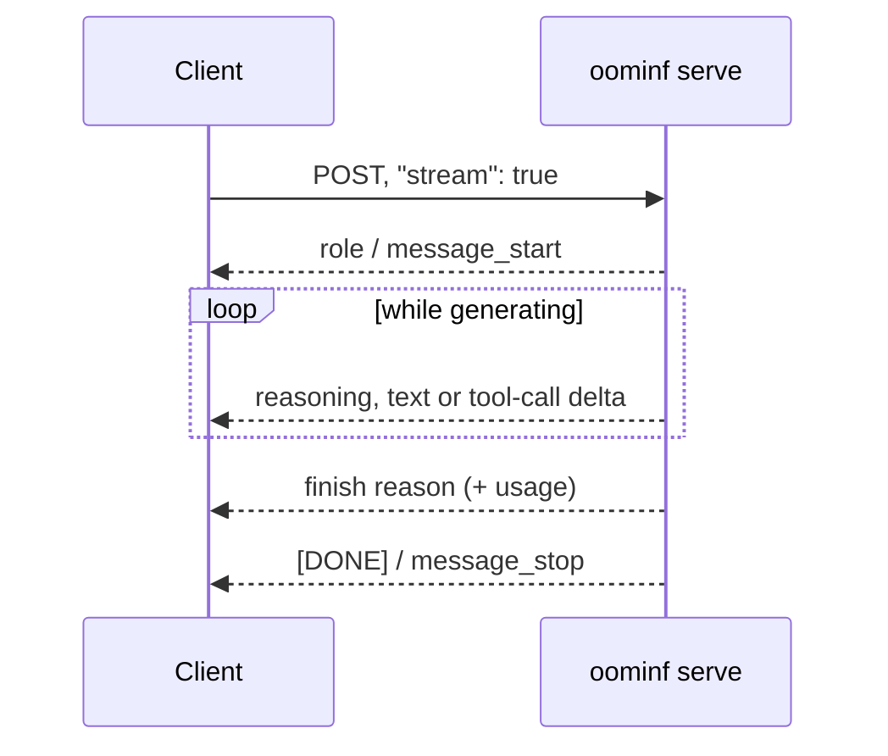
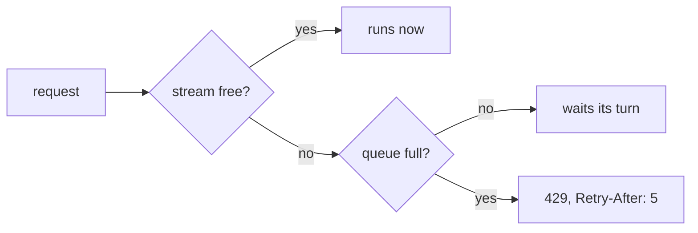

# API

`oominf serve` speaks the OpenAI Chat Completions API and the Anthropic Messages
API on the same port (default `http://127.0.0.1:8091`). Both drive the same
engine; use whichever your client already speaks.

| Method and path             | What it is                                                     |
| --------------------------- | -------------------------------------------------------------- |
| `POST /v1/chat/completions` | OpenAI-compatible chat completions, streaming or not           |
| `POST /v1/messages`         | Anthropic-compatible messages, streaming or not                |
| `GET /v1/models`            | The one served model, with its `context_length`                |
| `GET /v1/stats`             | Requests, context use, decode rate and where experts came from |
| `GET /health`               | `200 ok` once the model has loaded, `503 loading` before       |

There is no authentication: the server ignores API keys and other auth headers,
and accepts any `model` value in a request. Keep it on `127.0.0.1` (the default)
or a trusted network.

## Clients

Point an OpenAI client at `/v1` and an Anthropic client at the server root. The
SDKs insist on an API key, so pass any non-empty string.

```python
from openai import OpenAI

client = OpenAI(base_url="http://127.0.0.1:8091/v1", api_key="unused")
r = client.chat.completions.create(
    model="oominf",
    messages=[{"role": "user", "content": "Say hi."}],
    max_tokens=256,
)
print(r.choices[0].message.content)
```

```python
import anthropic

client = anthropic.Anthropic(base_url="http://127.0.0.1:8091", api_key="unused")
r = client.messages.create(
    model="oominf",
    max_tokens=256,
    messages=[{"role": "user", "content": "Say hi."}],
)
print(r.content)
```

Tools that read `OPENAI_BASE_URL` or `ANTHROPIC_BASE_URL` can be pointed the same
way.

## Requests

### OpenAI: `/v1/chat/completions`

    curl -s localhost:8091/v1/chat/completions -H 'content-type: application/json' -d '{
      "messages": [{"role": "system", "content": "Be brief."},
                   {"role": "user", "content": "Name three rivers."}],
      "max_tokens": 200, "temperature": 0.6}'

Supported fields: `messages`, `tools`, `tool_choice` (`auto` or `none`),
`stream`, `stream_options.include_usage`, `max_tokens` or
`max_completion_tokens`, `temperature` (0 to 2), `top_p` (above 0, at most 1),
`top_k`, `presence_penalty`, `frequency_penalty`, `seed`, `stop` (a string or a
list), `n` (only 1), `reasoning_effort` and `chat_template_kwargs`
(`enable_thinking`, `reasoning_effort`).

Without `max_tokens` a response may run to the end of the context
(`--max-context`), so set it. Sampling defaults come from the model's
`generation_config.json`. The response's `usage.prompt_tokens_details.cached_tokens`
says how much of the prompt was reused instead of prefilled.

### Anthropic: `/v1/messages`

    curl -s localhost:8091/v1/messages -H 'content-type: application/json' -d '{
      "max_tokens": 200, "system": "Be brief.",
      "messages": [{"role": "user", "content": "Name three rivers."}]}'

Supported fields: `max_tokens` (required), `messages` (text, `tool_use`,
`tool_result` and `thinking` blocks), `system` (a string or text blocks),
`tools` (`name`, `description`, `input_schema`), `tool_choice` (`{"type":
"auto"}` or `{"type": "none"}`), `stop_sequences`, `temperature`, `top_p`,
`top_k`, `stream` and `thinking`. Images and other block types are refused with 400. `usage.cache_read_input_tokens` counts reused prompt tokens.

## Thinking on or off

The model reasons before answering by default. The reasoning comes back
separately: `reasoning_content` in OpenAI responses, `thinking` blocks in
Anthropic ones.

| API       | Thinking off                                         | Effort                                                         |
| --------- | ---------------------------------------------------- | -------------------------------------------------------------- |
| OpenAI    | `"chat_template_kwargs": {"enable_thinking": false}` | `"reasoning_effort": "low"` (or inside `chat_template_kwargs`) |
| Anthropic | `"thinking": {"type": "disabled"}`                   | not exposed                                                    |

    curl -s localhost:8091/v1/chat/completions -H 'content-type: application/json' -d '{
      "messages": [{"role": "user", "content": "What is the capital of France?"}],
      "max_tokens": 32, "chat_template_kwargs": {"enable_thinking": false}}'

With thinking on, budget `max_tokens` for the reasoning too.

## Streaming

Set `"stream": true`. Responses are server-sent events.

- **OpenAI:** `chat.completion.chunk` events: the first carries the role, then
  deltas of `reasoning_content`, `content` or `tool_calls`, then one with
  `finish_reason`, an optional usage chunk (`stream_options.include_usage`), and
  `data: [DONE]`.
- **Anthropic:** `message_start`, then `content_block_start`,
  `content_block_delta` (`thinking_delta`, `text_delta`, `input_json_delta`) and
  `content_block_stop` per block, then `message_delta` with the stop reason and
  `message_stop`.

Closing the connection cancels the request.



## Tool calls

Pass tools in the API's own format; the server renders them with the model's
chat template and parses the model's calls back out.

    curl -s localhost:8091/v1/chat/completions -H 'content-type: application/json' -d '{
      "messages": [{"role": "user", "content": "What is the weather in Paris?"}],
      "tools": [{"type": "function", "function": {"name": "get_weather",
        "description": "Current weather for a city",
        "parameters": {"type": "object", "properties": {"city": {"type": "string"}},
                       "required": ["city"]}}}],
      "max_tokens": 512}'

The answer has `finish_reason: "tool_calls"` and `message.tool_calls` (OpenAI;
`arguments` is a JSON string) or `stop_reason: "tool_use"` and `tool_use`
blocks (Anthropic). Send the result back as a `tool` message (OpenAI) or a
`tool_result` block (Anthropic) and continue. Only `auto` and `none` are
supported for `tool_choice`; forcing a specific tool is refused with 400.

## Stats and health

    curl -s localhost:8091/health
    curl -s localhost:8091/v1/stats

`/v1/stats` returns:

| Field                                                                     | Meaning                                                                             |
| ------------------------------------------------------------------------- | ----------------------------------------------------------------------------------- |
| `requests.active`, `completed`                                            | Requests decoding now, and finished since start                                     |
| `requests.queued`, `rejected`                                             | Waiting for a stream now, and refused with 429 since start                          |
| `context.tokens`, `max`                                                   | Tokens in the live sequence, and `--max-context`                                    |
| `throughput.decode_tps`                                                   | Recent decode rate                                                                  |
| `experts.routed`, `vram_hits`, `host_hits`, `host_computed`, `disk_reads` | Where routed experts came from (cumulative; subtract two snapshots for an interval) |
| `tiers.vram`, `tiers.host`                                                | Records and bytes held by each tier                                                 |
| `instance_id`                                                             | Changes when the server restarts                                                    |

## Errors and overload

| Status | When                                                                                             |
| ------ | ------------------------------------------------------------------------------------------------ |
| 400    | Invalid request: unsupported field value, a prompt longer than `--max-context`, a template error |
| 429    | Too many requests are waiting. Retry after the `Retry-After` header (5 seconds)                  |
| 503    | The model is still loading                                                                       |
| 500    | The engine failed or stopped                                                                     |

The server runs up to `--max-streams` requests at once (default 2) and queues up
to `--max-queued` more (default 16). A request that arrives when the queue is
full is refused at once with 429, so a burst cannot grow memory. Clients should
honour `Retry-After`; the OpenAI and Anthropic SDKs retry 429s by default.
Errors use each API's error shape (`rate_limit_error` for 429 on both).


