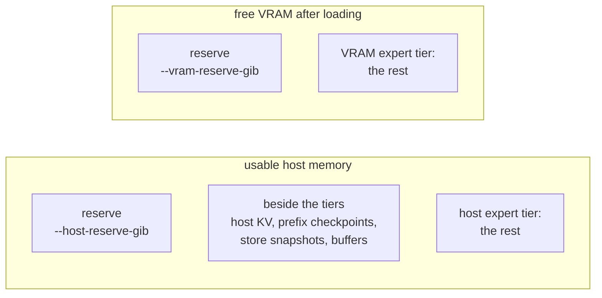

# Configuration

Everything is a flag on `oominf serve`; there is no config file. The defaults
are tuned for one machine like the reference box (24 GB GPU, 64 GB RAM, fast
NVMe) serving one or two interactive requests, and the engine sizes its memory
use from fresh checks on every start, so most setups need no flags at all.
`oominf serve --help` lists every flag with its default.

`oominf doctor --model model.oom` takes the same memory, context, stream and
precision flags and prints what `serve` would decide with them, without starting
the server. Try a change there first.

## Network

| Flag                  | Default                                   | What it does                                                                                                                   |
| --------------------- | ----------------------------------------- | ------------------------------------------------------------------------------------------------------------------------------ |
| `--host`              | `127.0.0.1`                               | Address to listen on. Use `0.0.0.0` to accept other machines; there is no authentication, so only do that on a trusted network |
| `--port`              | `8091`                                    | Port                                                                                                                           |
| `--served-model-name` | the model directory's name without `.oom` | The model name the API reports and accepts                                                                                     |

## Memory

The routed experts are cached in VRAM and in pinned host memory; whatever does
not fit is read from disk as needed. More memory for the tiers means fewer disk
reads and faster decoding ([hardware.md](hardware.md)).

On every start `oominf` checks, fresh:

- usable host memory: the smaller of `MemAvailable` and the container's limit
  (cgroup v2 `memory.max`/`memory.high` or v1 `limit_in_bytes`, less what the
  group already uses);
- what the model keeps in host memory beside the tiers: host-placed KV caches
  (`--kv-placement host`), prefix checkpoints, prefix store snapshots
  (`--prefix-store-dir`), transfer buffers;
- the reserve left to the page cache, the OS and other processes.

The host tier gets the rest. On a 64 GB machine it holds about 40 of the 68 GiB
of experts. The VRAM tier gets the VRAM that is free once the model and a first
sequence are loaded, less the VRAM reserve.

| Flag                 | Default                | What it does                                                                                                                            |
| -------------------- | ---------------------- | --------------------------------------------------------------------------------------------------------------------------------------- |
| `--host-reserve-gib` | `10`                   | RAM left for the page cache, the OS and other processes. Lowered as far as 3 when the smallest working tier needs it, unless you set it |
| `--vram-reserve-gib` | `2`                    | VRAM left free for activations and later allocations. Lowered to 1 when needed, unless you set it                                       |
| `--host-expert-gib`  | the rest of usable RAM | Fix the host tier's size instead. Shrunk with a warning if it does not fit                                                              |
| `--vram-expert-gib`  | the rest of free VRAM  | Fix the VRAM tier's size instead. Shrunk with a warning if it does not fit                                                              |

A size that does not fit is shrunk with a warning; when even the smallest
working tiers do not fit, a default reserve is lowered (to 3 GiB host, 1 GiB
VRAM) with a warning, and only then does start-up fail, listing what is needed.

When to change them:

- **Small machine or container, little else running:** lower
  `--host-reserve-gib`. At a 16 GiB container limit, `--host-reserve-gib 4` raised
  warm decode from 9.0 to 10.6 tok/s.
- **Other services on the same machine:** raise `--host-reserve-gib` (or cap
  `--host-expert-gib`) so the engine leaves them room.
- **Sharing the GPU:** cap `--vram-expert-gib`.

## Context length

| Flag              | Default     | What it does                                                                                                                                                           |
| ----------------- | ----------- | ---------------------------------------------------------------------------------------------------------------------------------------------------------------------- |
| `--max-context`   | `32768`     | Longest sequence (prompt plus output) the KV cache is sized for. Longer means more KV memory and more prefix checkpoints in host memory. Tested up to about 95k tokens |
| `--prefill-chunk` | the model's | Prompt tokens per prefill chunk; bounds prefill activation memory                                                                                                      |

## Concurrent requests

| Flag                | Default                       | What it does                                                                                                                                                                                  |
| ------------------- | ----------------------------- | --------------------------------------------------------------------------------------------------------------------------------------------------------------------------------------------- |
| `--max-streams`     | `2`                           | Requests decoding at once. Their tokens share each step: two streams run at about 48 tok/s in total, about 31 each, against about 43 for one. `1` serves one request at a time, to completion |
| `--max-queued`      | `16`                          | Requests that may wait for a free stream. More are refused at once with 429 and `Retry-After: 5`, so overload cannot grow memory                                                              |
| `--prefill-slice`   | `0` (whole prompts)           | Prefill long prompts in slices of this many tokens while other requests decode. Shortens their stall, but slows the long request and total throughput                                         |
| `--max-step-tokens` | `16`                          | Most tokens one batched step carries                                                                                                                                                          |
| `--step-cost`       | `1:22,2:37,4:54,8:117,16:255` | Step cost curve (width:ms) the scheduler trades drafts against; refined by measured steps                                                                                                     |

More streams help total throughput up to about 4 and make each stream slower
([D16](../dev/decisions.md#d16-one-batched-step)).

## Reusing long prompts (prefix store)

The server always keeps the last conversation on the GPU and continues it when
the next request extends it. With a prefix store it also saves conversations to
disk and restores them later, so an agent that comes back to a long document
does not pay for the prefill again (a 32k-token conversation restored in 0.9 s
against 28 s of prefill).

| Flag                        | Default | What it does                                                          |
| --------------------------- | ------- | --------------------------------------------------------------------- |
| `--prefix-store-dir`        | off     | Directory to save evicted sequences in. Setting it turns the store on |
| `--prefix-store-gib`        | `200`   | Disk budget; least recently used entries go first                     |
| `--prefix-store-ttl-hours`  | `72`    | Entries unused for longer are deleted                                 |
| `--prefix-store-min-tokens` | `1024`  | Shorter sequences are not saved                                       |

The store keeps up to three snapshots in host memory while writing them (about
0.75 GB each at 32k tokens), which comes out of the host expert tier.

## KV cache

| Flag             | Default  | What it does                                                                                                                                                                        |
| ---------------- | -------- | ----------------------------------------------------------------------------------------------------------------------------------------------------------------------------------- |
| `--kv-cache`     | `k8v6`   | KV cache format. `k8v6` is compressed (about 3x smaller, measured inside the model's own rounding noise); `fp32` is exact; `k<bits>v<bits>` or `tq<bits>` (2 to 8 bits) are lossier |
| `--kv-placement` | `device` | `host` keeps the attention K/V caches in host memory, read over PCIe. Same results; frees VRAM for experts. Measured 9% faster decode at 95k tokens and 4% slower at 32k            |

## Speed modes (lossy, off by default)

These trade a measurable shift in the model's output for speed. All three
together are the "max-perf config" the published speeds use.

| Flag                         | Gain                                                                                                               | Cost (against the exact reference)                                                                                                         |
| ---------------------------- | ------------------------------------------------------------------------------------------------------------------ | ------------------------------------------------------------------------------------------------------------------------------------------ |
| `--dense fp8`                | Faster decode (35-37 ms per verify step against 43-50 ms at 32k-95k tokens) and about 1,660 more VRAM expert slots | Next-token distributions shift about 3x the rounding floor (KL about 0.10-0.13, 86-88% top-1); retrieval and long-context tasks still pass |
| `--expert-precision bf16`    | Warm 32k-token prefill from 16.2 s to 14.0 s                                                                       | About at the rounding floor (KL 0.058, 92.1% top-1 at 32k)                                                                                 |
| `--attention-precision bf16` | About 15% faster prefill attention                                                                                 | Inside the rounding floor (KL 0.051, 92.6% top-1 at 32k)                                                                                   |

Decode attention stays exact in every mode. The measurements and why they are
off by default: [D4](../dev/decisions.md#d4-speed-modes-off-by-default).

## Drafting (speculative decoding)

| Flag              | Default | What it does                                                                                                                                                                              |
| ----------------- | ------- | ----------------------------------------------------------------------------------------------------------------------------------------------------------------------------------------- |
| `--draft`         | `1`     | Tokens the model's own draft head proposes per step. `0` turns speculative decoding off                                                                                                   |
| `--prompt-lookup` | `7`     | When the latest tokens repeat earlier text, draft the 7 tokens that followed instead. +22 to +40% output rate when output copies input (file edits); -2 to -9% on prose. `0` turns it off |

Drafts never change greedy output except at near ties, and sampling keeps the
model's distribution.

## Disk reads

| Flag          | Default | What it does                                                                                                                                                                                                                                               |
| ------------- | ------- | ---------------------------------------------------------------------------------------------------------------------------------------------------------------------------------------------------------------------------------------------------------- |
| `--io`        | `auto`  | How expert records are read: `auto` picks the fastest that works; `uring` (O_DIRECT through io_uring), `pread` (O_DIRECT on a thread pool) or `buffered` (through the page cache) force one. The log line `oominf: expert reads: ...` says which is active |
| `--lookahead` | `off`   | During decode, predict the next layer's experts and read predicted disk misses early. Off because only about a quarter of those reads were used and the rest cost decode speed ([D9](../dev/decisions.md#d9-no-decode-lookahead-by-default))               |

## CPU experts

| Flag             | Default                                                                          | What it does                                                                                                                                                 |
| ---------------- | -------------------------------------------------------------------------------- | ------------------------------------------------------------------------------------------------------------------------------------------------------------ |
| `--host-compute` | `6`, or `0` when the hardware profile finds the CPU much slower than a PCIe copy | Experts per layer and decode step computed on the CPU from host memory instead of copied to the GPU. `0` copies every one and makes greedy output repeatable |
| `--host-threads` | one per physical core                                                            | CPU threads for those experts                                                                                                                                |

## Hardware profile

The first `serve` on a machine measures the drive, the PCIe link and the CPU for
about a second and caches the result in `$XDG_CACHE_HOME/oominf/` (or
`~/.cache/oominf/`). A change of GPU, driver, CPU, usable CPUs, RAM or the
model's drive measures again. The profile only turns CPU experts off on a slow
CPU and shrinks the prefill staging ring on a slow drive; a flag you give always
wins.

| Flag               | What it does                                        |
| ------------------ | --------------------------------------------------- |
| `--no-probe`       | Do not measure or read a profile: built-in defaults |
| `--reprobe`        | Measure again even if a cached profile matches      |
| `--profile <file>` | Use this profile file                               |

`oominf tune --model model.oom [--out <file>]` measures four times longer
(median of three rounds) and writes the profile `serve` will use.

## Advanced

| Flag            | Default      | What it does                                                                     |
| --------------- | ------------ | -------------------------------------------------------------------------------- |
| `--experts`     | `tiered`     | `disk` reads and uploads every record with no cache (for testing)                |
| `--vram-policy` | `lrfu:7680`  | VRAM tier eviction policy: `lru`, `lfu` or `lrfu:<half-life in expert accesses>` |
| `--host-policy` | `lrfu:30720` | Host tier eviction policy, same syntax                                           |

## Examples

Fastest measured setup, accepting the lossy modes:

    oominf serve --model model.oom --dense fp8 --expert-precision bf16 --attention-precision bf16

An agent server that comes back to long documents:

    oominf serve --model model.oom --max-context 98304 --prefix-store-dir ~/.cache/oominf/prefixes

One request at a time, repeatable greedy output:

    oominf serve --model model.oom --max-streams 1 --host-compute 0
