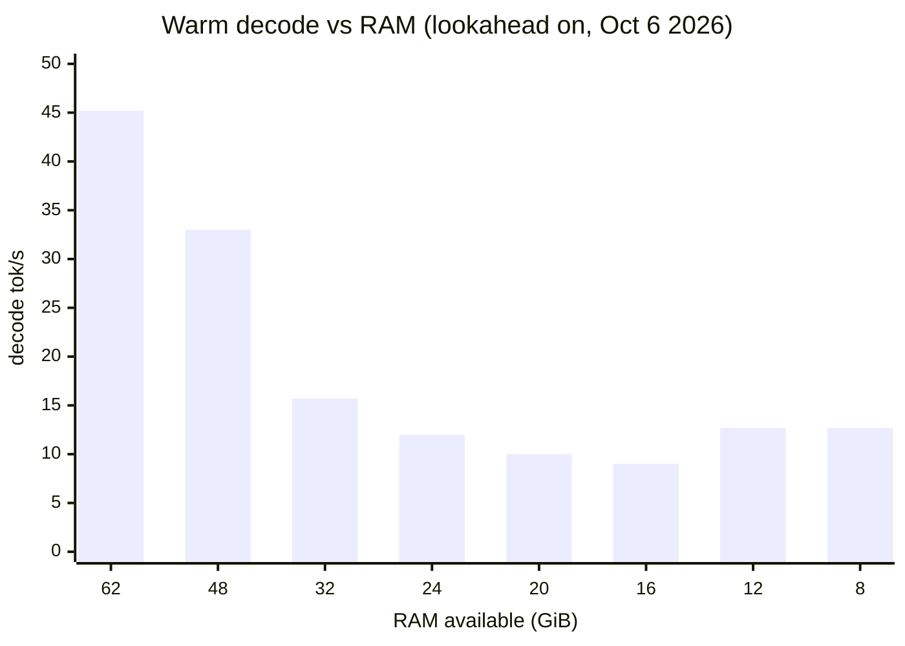

# Hardware sizing

What your machine will get. oom-inference sizes itself on every start from what
it finds (usable RAM including a container's limit, free VRAM, which disk read
path works) and shrinks instead of failing, so the question is how fast, not
whether.

Run `oominf doctor --model model.oom` to see what `serve` would decide on your
machine without starting it.

## What decides the speed

| Part | What it does                                                                                                            | Reference box                  |
| ---- | ----------------------------------------------------------------------------------------------------------------------- | ------------------------------ |
| GPU  | Holds the dense weights, the KV cache and as many experts as fit. Every expert compute runs here except the CPU's share | RTX 4090, 24 GB                |
| RAM  | Holds the host expert tier: the more experts in RAM, the fewer disk reads per token                                     | 64 GB (62 GiB usable)          |
| NVMe | Holds the converted model (about 135 GB); every expert that is in neither tier is read from it                          | Kingston KC3000 2 TB, 6.9 GB/s |
| CPU  | Computes some experts straight from RAM during decode                                                                   | Ryzen 7 7800X3D, 8 cores       |
| PCIe | Copies experts from RAM to the GPU                                                                                      | 26.8 GB/s measured             |

Decode speed follows how many experts fit in RAM and VRAM. Prefill (reading the
prompt) is less sensitive: it touches most experts anyway.

## Measured: less RAM

Measured October 6, 2026 on the reference box with smaller machines simulated by
container memory limits (no swap). Each run served the 21.9k-token demo prompt
(cold experts, then warm) and short prompts; every answer was checked. The runs
used the lossy speed modes (`--dense fp8 --expert-precision bf16
--attention-precision bf16`), 2 streams, 32k context, and had decode lookahead
on, which is now off by default and was measured faster (see the note below).

| RAM available to the server    | Host expert tier (GiB) | Prefill tok/s, warm | Decode tok/s, warm |
| ------------------------------ | ---------------------- | ------------------- | ------------------ |
| 62 GiB (no limit)              | 44.3                   | 3,118               | 45.2               |
| 48 GiB                         | 34.7                   | 3,076               | 33.0               |
| 32 GiB                         | 18.7                   | 2,749               | 15.7               |
| 24 GiB                         | 10.7                   | 2,450               | 12.0               |
| 20 GiB                         | 6.7                    | 2,317               | 10.0               |
| 16 GiB                         | 2.7                    | 2,193               | 9.0                |
| 16 GiB, `--host-reserve-gib 4` | 8.6                    | 2,377               | 10.6               |
| 12 GiB (minimum tiers)         | 0.8                    | 847                 | 12.7               |
| 8 GiB (minimum tiers)          | 0.8                    | 845                 | 12.7               |
| 7 GiB                          | refuses to start       |                     |                    |

The VRAM expert tier was 16.4 GiB in every run.

- **Tested minimum: an 8 GiB container (no swap)** with the default 32k context
  and 2 streams serves the 22k-token prompt correctly, at about a third of the
  reference prefill rate. Below that, start-up refuses with a message listing
  what is needed, instead of being killed later.
- **Decode follows the host tier.** Every GiB the tiers lose becomes disk reads.
- **At the minimum** prefill drops to about 800 tok/s. Decode there is faster
  than at 16 to 24 GiB because lookahead was capped off at the minimum; with
  lookahead off everywhere (today's default) the larger machines gain:
  warm decode of the demo measured 12.8 instead of 8.4 to 9.0 tok/s at 16 GiB,
  20.2 instead of 15.7 at 32 GiB, 39.3 instead of 33.0 at 48 GiB, and 49.7
  instead of 45.2 without a limit.
- **On a small machine with little else running**, lower `--host-reserve-gib`:
  at 16 GiB the default 10 GiB reserve was mostly unused.

The full run log, including CPU-count and read-path runs and an overload test,
is in [measurements.md](../dev/measurements.md#simulated-machines-october-6-2026).

## What more of each buys

- **More RAM:** a larger host tier and faster decode, up to the point where all
  68 GiB of experts fit beside the reserve and the memory the server keeps
  next to them. On 64 GB the host tier holds about 40 GiB of them.
- **More VRAM:** a larger VRAM tier, fewer copies over PCIe, faster decode; also
  room for longer contexts. Only 24 GB has been tested.
- **A faster NVMe drive:** faster cold prompts and faster decode misses. With
  `--io buffered` (no O_DIRECT) prefill was about 20% slower and decode about a
  third slower, which gives an idea of how much the read path matters.
  `oominf doctor` and `serve` warn when scattered reads run under 1 GB/s,
  reading the dense weights would take over 60 s, or host-to-device copies run
  under 6 GB/s.
- **More CPU cores:** little. With 4 CPUs warm decode was 35.9 tok/s and with 2
  CPUs 34.7, against 45.2 with 16; with 2 CPUs the engine turns CPU experts off
  by itself, and start-up took 58 s against 26 to 29 s.
- **Disk space:** about 135 GB for the converted model plus the download while
  converting (about 155 GB). A prefix store (`--prefix-store-dir`) takes up to
  200 GiB by default.

## Not verified

These have not been measured on real hardware:

- **A slower disk.** The slow-drive warnings have not been seen on a slow drive.
- **io_uring or O_DIRECT actually unavailable** (a container's seccomp profile, an
  old kernel, a filesystem without O_DIRECT). Only the forced fallbacks
  (`--io pread`, `--io buffered`) were run.
- **Smaller GPUs.** Every run had the 4090's 24 GB. The planner shrinks the VRAM
  tier and refuses below its minimum, but this is covered by tests only.
- **cgroup v1** container limits (parsing is tested, no v1 machine was run).
- Other GPU models and drivers, non-x86 hosts, and Windows (see
  [install.md](install.md)).

If you run it on different hardware, `oominf doctor` output and the decode rate
from `/v1/stats` are the most useful things to share.
