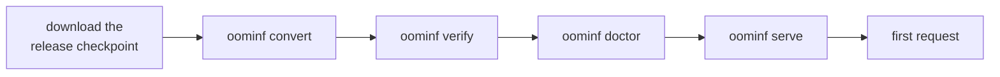

# Quickstart

From a built `oominf` to a first answer. You need a Linux machine with an NVIDIA
GPU and the binary built as in [install.md](install.md); the commands below
assume `oominf` is on your `PATH` (otherwise use `target/release/oominf`).

## 1. Disk space

| What                          | Size                                                   | Where                                            |
| ----------------------------- | ------------------------------------------------------ | ------------------------------------------------ |
| Release checkpoint (download) | about 155 GB                                           | any disk; delete it after converting if you like |
| Converted model (`model.oom`) | about 135 GB: dense 10 GB, experts 73 GB, tables 51 GB | a local NVMe drive                               |

The engine reads experts from the converted model while it serves, so a slow
drive directly slows cold prompts and decode misses. `oominf doctor` measures
the drive and warns (see [hardware.md](hardware.md)).

## 2. Get the checkpoint

oom-inference serves **Qwen3.8-Flash-Next** in the NVFP4 release
[`RadixArk/Qwen3.8-Flash-Next-NVFP4`](https://huggingface.co/RadixArk/Qwen3.8-Flash-Next-NVFP4),
tested at revision
[`7b719225242aacd3dbd3f9407468c2ee9a9d2594`](https://huggingface.co/RadixArk/Qwen3.8-Flash-Next-NVFP4/tree/7b719225242aacd3dbd3f9407468c2ee9a9d2594).
Download it with the Hugging Face CLI (`hf`, from the `huggingface_hub` Python
package):

    hf download RadixArk/Qwen3.8-Flash-Next-NVFP4 \
        --revision 7b719225242aacd3dbd3f9407468c2ee9a9d2594 \
        --local-dir ~/models/Qwen3.8-Flash-Next-NVFP4

## 3. Convert and check it

Conversion re-lays the released bytes out for the engine (one record per expert)
without changing any weight. Run it once; `--out` must not already hold a
converted model.

    oominf convert --src ~/models/Qwen3.8-Flash-Next-NVFP4 --out ~/models/model.oom
    oominf verify ~/models/model.oom      # recomputes every checksum; "0 mismatches"
    oominf inspect ~/models/model.oom     # sizes and the expert record layout

## 4. Check the machine

    oominf doctor --model ~/models/model.oom

`doctor` prints what `serve` would decide here without starting it: the GPU,
CPU, RAM and drive it found, the cached hardware profile, how much VRAM and host
memory the expert tiers would get, and any warnings. If it reports that the
smallest working configuration does not fit, see
[troubleshooting](troubleshooting.md#start-up-says-memory-does-not-fit).

## 5. Serve

    oominf serve --model ~/models/model.oom

The server listens on `127.0.0.1:8091` at once and loads the model in the
background (about half a minute on the reference machine). The first start on a
machine also measures the hardware for about a second and caches the result in
`~/.cache/oominf/`. When it is ready the log says `oominf: ready`, and:

    curl -s localhost:8091/health          # "ok" once loaded, "loading" before

## 6. First request

OpenAI-style:

    curl -s localhost:8091/v1/chat/completions -H 'content-type: application/json' \
      -d '{"messages": [{"role": "user", "content": "Say hi."}], "max_tokens": 64}'

The model thinks before answering by default; the reasoning comes back in
`reasoning_content`. To get a direct answer, turn thinking off:

    curl -s localhost:8091/v1/chat/completions -H 'content-type: application/json' \
      -d '{"messages": [{"role": "user", "content": "What is the capital of France?"}],
           "max_tokens": 32, "chat_template_kwargs": {"enable_thinking": false}}'

The [API guide](api.md) covers streaming, tool calls, the Anthropic endpoint and
pointing existing clients at the server. Stop the server with Ctrl-C.

## Other commands

    oominf generate --model model.oom --prompt "Hello"     # one greedy chat turn, no server
    oominf bench --model model.oom                         # decode speed and tier statistics
    oominf tune --model model.oom                          # measure this machine, write the profile
    oominf doctor --model model.oom                        # what serve would decide here
    oominf <command> --help                                # every flag with its default

Next: [configuration](configuration.md) for the flags worth changing, and
[hardware.md](hardware.md) for what to expect on your machine.
