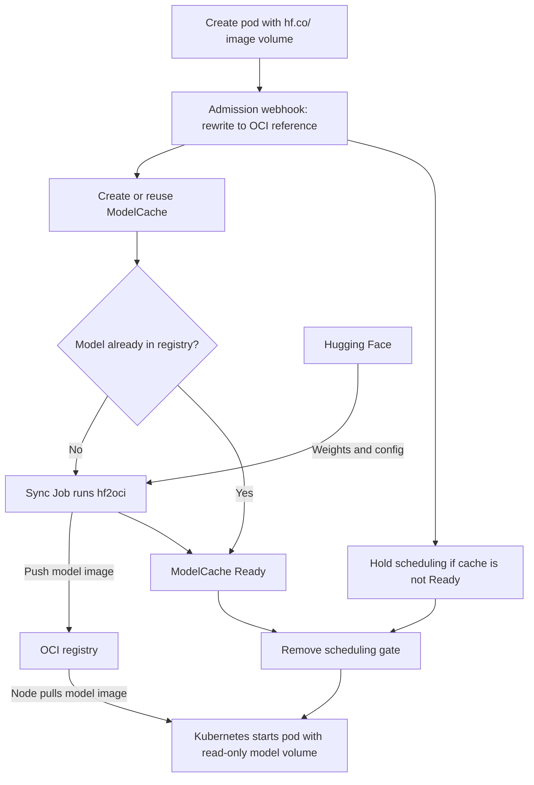

# OCI Model Cache Operator

Mount Hugging Face models in Kubernetes pods using your OCI registry as the cache.
Declare an `hf.co/` reference in a pod's image volume, and the operator copies the
model to your registry, waits for it to be ready, and lets Kubernetes mount the
files read-only. Your inference image stays separate from the model weights, and
application pods do not need a Hugging Face download init container or a model PVC.

The operator manages **cluster-scoped `ModelCache` resources** and runs
[`hf2oci`](../../../bazel/tools/hf2oci) Jobs to copy weights and configuration
files. It supports safetensors and GGUF models.

## How it works



The webhook rewrites the volume reference **during pod creation**, before the pod
spec becomes immutable. A cache miss holds the pod in `SchedulingGated` while the
copy runs. If the `ModelCache` is already `Ready`, the pod skips the gate. An
existing registry artifact also lets the controller skip the copy Job.

The registry is the shared cache; each node still needs to pull the model image
before mounting it. The operator does not preload weights onto every node.

## Before you start

- A Kubernetes cluster and container runtime that support
  [image volumes](https://kubernetes.io/docs/concepts/storage/volumes/#image),
  with the feature enabled where required by your Kubernetes version.
- cert-manager for the Helm chart's webhook certificate and CA injection.
- An OCI registry reachable by the operator, sync Jobs, and workload nodes.
  Sync Jobs need push credentials; private images also need pull credentials
  on the consuming pods or nodes.

Install the [Helm chart](helm/oci-model-cache-operator) from this repository.
Replace the registry below with your own. `model-registry-push` must already exist
in the operator namespace and contain a `.dockerconfigjson` key with push access
(for example, provisioned through the 1Password Operator).

```bash
# Run from the repository root.
helm upgrade --install oci-model-cache \
  ./projects/operators/oci-model-cache/helm/oci-model-cache-operator \
  --namespace oci-model-cache --create-namespace \
  --set controllerManager.env.ociRegistry=ghcr.io/YOUR_ORG/models \
  --set registryPushSecret=model-registry-push
```

See [chart values](helm/oci-model-cache-operator/values.yaml) for image overrides,
sync Job memory and placement settings, and Hugging Face authentication. For
private or gated models, configure `hfToken.existingSecret` and `hfToken.secretKey`
with a token that has access to the repository. Registry push credentials are
separate from workload pull credentials.

## Example: mount a model

With the operator installed, opt a namespace into the webhook:

```bash
kubectl create namespace model-demo
kubectl label namespace model-demo oci-model-cache.jomcgi.dev/enabled=true
```

Save this as `model-demo.yaml`. This pod lists the model files so you can check
the mount without a GPU or an inference server:

```yaml
apiVersion: v1
kind: Pod
metadata:
  name: model-demo
  namespace: model-demo
spec:
  restartPolicy: Never
  containers:
    - name: inspect
      image: busybox:1.37
      command: ["sh", "-c", "ls -lh /models"]
      volumeMounts:
        - name: model
          mountPath: /models
          readOnly: true
  volumes:
    - name: model
      image:
        reference: hf.co/Qwen/Qwen2.5-0.5B-Instruct
        pullPolicy: IfNotPresent
```

If your registry is private, add `imagePullSecrets` to the pod using a pull Secret
in `model-demo`. Then create the pod and inspect progress:

```bash
kubectl apply -f model-demo.yaml
kubectl get modelcaches
kubectl get pods -n model-demo --watch
# Once model-demo completes, stop the watch and read its output.
kubectl logs -n model-demo model-demo
```

On a cache miss, expect `SchedulingGated` while the model is copied, then normal
pod startup and `Completed`. The logs list the weights and configuration files
at `/models`, the mount point for the model image's root. In an inference
workload, point your server at that directory.

### Selecting a GGUF variant

Use `hf.co/{org}/{model}:{filename-prefix}` to select a GGUF file. The suffix is a
**filename prefix, not a Hugging Face revision or an OCI tag**. For example:

```yaml
reference: hf.co/bartowski/Llama-3.2-1B-Instruct-GGUF:Llama-3.2-1B-Instruct-Q4_K_M
```

A selector is required when the repository contains multiple GGUF files. Repos
that mix GGUF and safetensors weights are rejected by the copy tool.

## Cache a model explicitly

You can also create a `ModelCache` without a pod or the namespace webhook opt-in.
For example, apply this manifest after replacing the registry:

```yaml
apiVersion: oci-model-cache.jomcgi.dev/v1alpha1
kind: ModelCache
metadata:
  name: qwen-demo
spec:
  repo: Qwen/Qwen2.5-0.5B-Instruct
  registry: ghcr.io/YOUR_ORG/models
  revision: main
```

Wait for the cache and retrieve the OCI reference:

```bash
kubectl wait --for=jsonpath='{.status.phase}'=Ready modelcache/qwen-demo --timeout=30m
kubectl get modelcache qwen-demo -o jsonpath='{.status.resolvedRef}{"\n"}'
```

Use that reference directly in a pod's `volumes[].image.reference`. To select a
specific Hugging Face commit, set `spec.revision` to its SHA. The `hf.co/` shorthand
uses the default revision, `main`. See the [API types](api/v1alpha1/modelcache_types.go)
for the full spec and status fields.

## Troubleshooting and current limits

- **Pod stays gated:** inspect `kubectl get modelcaches -o yaml` for `status.phase`,
  `status.errorMessage`, and `status.syncJobName`. Sync Jobs run in the operator's
  namespace; inspect their logs with `kubectl logs -n oci-model-cache job/JOB_NAME`.
- **Reference was not rewritten:** check the namespace label and webhook health.
  The chart uses `failurePolicy: Ignore`, so a webhook outage can admit a pod with
  its original `hf.co/` reference.
- **Multiple uncached models in one pod:** the webhook currently tracks only the
  first waiting `ModelCache`. Cache each model explicitly and use its OCI
  reference when a pod needs multiple models.
- **TTL:** an optional `spec.ttl` expires the `ModelCache` resource based on its
  creation time. It does not delete the artifact from the OCI registry.

## Code map

| Path                                                                         | Responsibility                                             |
| ---------------------------------------------------------------------------- | ---------------------------------------------------------- |
| [cmd](cmd)                                                                   | Operator entrypoint and hf2oci resolver adapter            |
| [api](api)                                                                   | `ModelCache` API definitions                               |
| [internal/webhook](internal/webhook)                                         | Pod admission, reference rewriting, and scheduling gates   |
| [internal/controller](internal/controller)                                   | Reconciliation, sync Jobs, gate removal, and TTL cleanup   |
| [internal/hfref](internal/hfref), [internal/naming](internal/naming)         | Parse Hugging Face references and derive resource names    |
| [internal/statemachine](internal/statemachine)                               | Generated state machine with compiler-enforced transitions |
| [internal/config](internal/config), [internal/telemetry](internal/telemetry) | Runtime configuration and OpenTelemetry tracing            |
| [helm](helm), [deploy](deploy)                                               | Helm chart and this repository's deployment configuration  |
