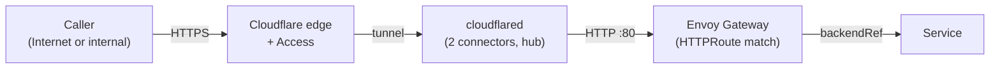

# Platform Architecture

The cluster infrastructure: the pieces every service depends on, plus the repo-level delivery machinery (chart publish, promotion, merge queue) that puts them there, across the two clusters that exist today. Current as of e18559df9 (2026-09-05). Unflagged claims are built and live; anything decided but not shipped says so and names its tracking issue. Historical ADR labels in the body point to the decision history at the end.

---

## 1. Clusters

Two clusters, one repository. **The GKE hub** (`homelab-hub`, a zonal Standard cluster in `europe-west2`) has served every public and private workload since the 2026-08-31 cutover: the monolith with its public and agents tiers, EmberVM, Context Forge, authentik, the ingress, and the inference embeddings pod. **The home k3s cluster** is residual. It still runs LLM inference on its GPU node, the model-cache operator, and the platform components listed in `projects/platform/kustomization.yaml`, with its ingress connectors drained to zero. It is being torn down (#5485); the program around it (#4964) keeps the hub as the permanent management plane.

Each cluster has its own in-cluster ArgoCD and its own root Application. Home's root (`canada`) exists only as a live object and syncs the generated `projects/home-cluster/kustomization.yaml`. The hub's root (`hub`) is committed at `projects/gke-cluster/root-application.yaml`, deliberately absent from the kustomization it syncs, and applied by hand after review: a self-managing root would reconcile away its own repair. It syncs two hand-maintained trees. `projects/platform-gke/` holds one Application per shared component, each pointing at the chart under `projects/platform/` with a `values-gke.yaml` overlay. `projects/gke-apps/` holds one Application per workload, consuming the service's `deploy/values.yaml` plus `values-gke.yaml` through a `$values` git ref. `bazel/images/generate-home-cluster.sh` excludes the three GKE trees and the migrated workloads from the home root, so nothing enrolls in both clusters by accident.

The hub runs two `gcloud`-managed node pools (ADR platform/016). `core-e2` is one on-demand `e2-standard-8` carrying every non-brick workload. `ember-bricks` is Spot `n2-standard-8`, autoscaling 1 to 3, tainted `embervm.jomcgi.dev/node=true` with nested virtualisation on, and carries EmberVM bricks plus the embeddings pod. The core pool never gets `embervm.io/serving=true`: the serving-envoy DaemonSet selects on that label and crash-loops on a non-brick node. Spot preemptions hit the brick pool several times a day; the platform tier no longer sees any.

`bazel/tools/ci/check-application-drift.sh` renders the hub's Applications from git and diffs them against the live objects, ignoring only `targetRevision`. It needs a cluster context, so it is an operator command rather than a CI gate.

(see: `projects/gke-cluster/`, `projects/platform-gke/kustomization.yaml`, `projects/gke-apps/kustomization.yaml`, `projects/home-cluster/kustomization.yaml`, `bazel/images/generate-home-cluster.sh`, `docs/runbooks/gke-cutover-window.md`)

**Why.** Every platform singleton had been living on Spot in a zone with a real
preemption rate, taking a one to three minute blip several times a day, and
the on-demand pool created to anchor EmberVM's stateful volumes could never
host a brick because its AMD machine type has no nested virtualisation (ADR
platform/016). An on-demand N2 core that also anchors one brick was rejected as
paying to mask two EmberVM recovery bugs that program already owns; all-Spot
with spread rules was rejected as the least stable shape; a tiny on-demand
seat for a few singletons was rejected on complexity per dollar saved. One
on-demand core pool plus Spot bricks accepts that stateful EmberVM work stays
on Spot and recovers from its export, and that the core pool needs a manual
resize if the non-brick footprint outgrows one node. The committed,
hand-applied root trades a reviewable record of the cluster's root of trust
for one deliberate `kubectl apply` per root change.

---

## 2. Ingress and traffic

External traffic enters through a Cloudflare Tunnel (a persistent outbound connection from the cluster to Cloudflare's edge), reaches the Envoy Gateway proxy data plane, and routes to services via Kubernetes `HTTPRoute` resources. No traffic is exposed to the internet directly (ADR networking/001).

**Request path:**



Both clusters' `cloudflared` Deployments share one tunnel credential. The hub runs two connectors and home is drained to zero, so moving ingress between clusters is a `tunnel.replicaCount` change in each overlay and nothing else. On the hub the Envoy Gateway chart owns every Gateway API CRD; GKE's own Gateway API addon is disabled because its standard-channel bundle lacks the `ListenerSet` CRD Envoy Gateway requires.

Two ingress tiers route by audience (ADR networking/002), carried as the `ingress-tier` label on each `HTTPRoute`:

- **public**: unauthenticated routes on the public hostnames
- **trusted**: a `SecurityPolicy` validates a Cloudflare Access JWT and maps the `email` claim to `X-Auth-Email` (`cf-ingress-library/templates/_security-policy.tpl`). A few routes use an authentik OIDC policy instead of Cloudflare Access

All converge on the same Envoy instance. The ingress library (`cf-ingress-library/`) provides shared `HTTPRoute` templates that services import rather than hand-rolling. Services define their routes in `deploy/values.yaml` and ArgoCD renders them. The hub serves fourteen routes on one Gateway across `jomcgi.dev`, `private.jomcgi.dev`, `friends.jomcgi.dev`, `auth.jomcgi.dev`, `mcp.jomcgi.dev` and `ships.jomcgi.dev`. The ArgoCD UI has no route on either cluster (`cfIngress.enabled: false` in `projects/platform/argocd/values.yaml`); Kargo's UI is at `private.jomcgi.dev/app/kargo` behind Cloudflare Access.

**Edge caching.** Anonymous public pages and data endpoints are cache-eligible at Cloudflare: the origin emits `Cache-Control: public, s-maxage=60, stale-while-revalidate=86400, stale-if-error=31536000` and a hostname-scoped Cloudflare cache rule honours it, so `cf-cache-status` on `jomcgi.dev/` reads HIT or EXPIRED rather than DYNAMIC (ADR platform/003, originally scoped to `public.jomcgi.dev`, a hostname that no longer resolves now that the apex is the monolith). The rule lives only in the Cloudflare dashboard, not in this repo; the remaining cache settings and the miss-rate alert are open at #3876. `jomcgi.dev/docs/*` is served by the monolith frontend from repo markdown (`projects/monolith/frontend/src/routes/public/docs/`); there is no separate docs site or Cloudflare Pages project (ADR docs/002).

(see: `projects/platform/cloudflare-gateway/`, `projects/platform/cloudflare-gateway/values-gke.yaml`, `projects/platform/cf-ingress-library/`, ADR networking/001, ADR networking/002)

**Why.** The former operator reimplemented routing primitives while production
still used a separate static tunnel configuration, so Envoy Gateway took over
in-cluster routing and the operator scope narrowed to edge lifecycle (ADR
networking/001). Per-service hostnames were rejected because every service added
manual DNS and optional SSO configuration; audience tiers make private exposure
the default and public exposure explicit (ADR networking/002). The shared gateway
accepts path-conflict risk and makes route-overlap checks part of CI.

---

## 3. Network and CNI

**The hub's CNI is GKE Dataplane V2**, Google's managed Cilium (`anetd`). This repo's Cilium chart is not deployed there, and the Cilium API the hub exposes is endpoints, identities, nodes and local redirect policies only: there is no `CiliumNetworkPolicy` or `CiliumClusterwideNetworkPolicy` kind, no Hubble, and no WireGuard. Every chart's Cilium policy is therefore switched off in its `values-gke.yaml` (the monolith's ingress and token-replay rules, monolith-public's ingress and egress, monolith-agents, EmberVM's noded and token broker), because the chart default would wedge each Application on its first sync against a missing CRD. Plain `NetworkPolicy` is the only enforcement available and one exists today, on Context Forge's redis, so cross-namespace traffic on the hub is otherwise unrestricted and nothing on the hub claims wire encryption. That trade, a Cilium dataplane kept and the policy CRDs and encryption lost, was made in the cutover overlays; no ADR records it, and ADR networking/003's remaining items (L7 HTTP policy, default-deny) have no target on the hub. #3873 stays open as the record.

**Home** still runs the chart under `projects/platform/cilium/`, which replaced Linkerd's sidecar mesh (ADR platform/012), until #5485 tears the cluster down: eBPF L3/L4 `CiliumNetworkPolicy` enforcement in allow-until-selected mode, pod-to-pod WireGuard on `cilium_wg0` (node-to-node encryption was set and never in force, #5146 closed as obsolete), Hubble flow logs with cert-manager-rotated mTLS, and kube-proxy replacement. Two home-only behaviours worth keeping in mind while it lives: Cilium enforces egress policy after DNAT, so a probe from an unlisted namespace is dropped as a silent timeout rather than refused, and its `tcx` attachment is what makes the CAKE shaper in section 6 inert.

(see: `projects/monolith/deploy/values-gke.yaml`, `projects/monolith-public/deploy/values-gke.yaml`, `projects/embervm/deploy/values-gke.yaml`, `projects/platform/cilium/values.yaml`, ADR platform/012, ADR networking/003)

**Why.** Linkerd sidecars prevented ordinary network policy in meshed namespaces,
kept Jobs alive, and added a container and hop to every pod (ADR platform/012).
Keeping Linkerd over Cilium was rejected because it preserves the policy blind
spot and doubles data-plane complexity; enabling every Cilium capability in one
cutover was rejected because default-deny and L7 proxying carry separate blast
radii (ADR platform/012, ADR networking/003). Cilium therefore replaces the mesh
incrementally, accepting label-derived authorization in place of per-connection
workload identity and added latency only on selected L7 surfaces.

---

## 4. GitOps and delivery

**ArgoCD** is the control plane on both clusters (3.1.8 on the hub), with the roots described in section 1. Every service and platform component is an `Application` CR; ArgoCD watches the repo and reconciles the cluster to match git.

**Service tier chart versioning is decoupled from merge.** On merge to main, CI computes the next semver from conventional commits, builds and publishes the chart to OCI (`ghcr.io/jomcgi/homelab/charts`), and `chart-version-bot` writes `version:` and `targetRevision:` back to `Chart.yaml` and `deploy/application.yaml` on main (ADR platform/009, ADR platform/011). PRs never touch either line; the pre-push hook `bazel/tools/hooks/check-chart-version-targetrevision-sync.sh` blocks one that does. Publish idempotency and missed-bump detection live in `bazel/helm/chart-version.sh`, `write-back-versions.sh` and `check-missed-bump.sh`. The write-back is monotonic, so concurrent main runs converge on the newest version rather than the last job to finish. For the workloads that moved to the hub, `projects/<svc>/deploy/application.yaml` deploys nothing any more: it is the record of the latest published version and the revert lever, while the hub's own pins live in `projects/gke-apps/`.

**Platform tier components** deploy on merge. Every `projects/platform/*/application.yaml` and every Application under `projects/platform-gke/` tracks git HEAD with no OCI chart version, so a platform change lands the moment it merges, with no write-back step.

**Kargo owns promotion on the hub** for the monolith, monolith-public and EmberVM, with a prod stage only. Each pipeline's Warehouse polls the OCI registry every five minutes; a new chart becomes Freight, and the prod Stage auto-promotes it with `argocd-update` followed by `argocd-wait`, so a chart that cannot come up fails its Promotion instead of sitting half-rolled. There is no dev stage on the hub, therefore no soak and no pre-production exposure: the gate is point-in-time readiness, with no functional assertion (#4745). The wait timeout is measured per pipeline (30 minutes for EmberVM, whose bricks rebuild a guest rootfs one node at a time). The `projects/gke-apps` pins for these three Applications are bootstrap floors that Kargo patches past on the live object, so `git != live` is correct there. Read the deployed version from the hub:

```bash
kubectl get application monolith -n argocd -o jsonpath='{.spec.sources[0].targetRevision}'
```

The root carries an `ignoreDifferences` entry per promoted Application plus `RespectIgnoreDifferences=true`; without the sync option a sync stamps the git value back. The entry is not free: a JSON pointer into `spec.sources` stops ArgoCD patching any field in that array, which once left four Applications on a stale `repoURL` for weeks while the root reported success. That is what the drift check in section 1 exists to catch. `monolith-agents` is pinned by hand in `projects/gke-apps` and is not Kargo-managed; `inference` and `context-forge-gateway` deploy from git HEAD.

**The merge queue is GitHub's native one**, configured on the default-branch ruleset (`lets-not-delete-everything`): rebase merges only, `HEADGREEN` grouping, build up to 3 entries, merge up to 5, and a 3-minute minimum wait. `gh pr merge --auto --rebase` enqueues; nobody rebases a PR because main moved, the queue does. The chart write-back commit lands under an org-admin bypass so it never queues behind itself. The `ready-to-merge` label exists and means "reviewed by the judgment tier", but nothing in the repo consumes it: the stateless DBOS reconciler that would (ADR platform/014) was never built and its issues are closed.

**Per-PR preview environments do not exist.** ADR platform/005 (label-gated ApplicationSet previews with copy-on-write CNPG clones) is Draft and unbuilt: no `ApplicationSet` exists on either cluster, and the hub has no second lane at all. Tracked at #3882 (#3883 to #3887).

(see: `projects/gke-cluster/root-application.yaml`, `projects/gke-apps/`, `projects/platform/kargo/values.yaml`, `projects/platform/kargo/README.md`, `bazel/helm/README.md`, `.claude/skills/pr-workflow/`, ADR platform/009, ADR platform/011, ADR platform/014)

**Why.** Branch-side chart bumps caused duplicate versions, merge conflicts, and
merged changes that never deployed when a bump was lost (ADR platform/009, ADR
platform/011). Floating OCI revisions were rejected because ArgoCD cannot follow
OCI semver ranges, while a production-only Kargo stage was rejected because it
adds a controller without a validation stage. Post-merge idempotent publishing
and monotonic write-back remove PR contention, and Kargo promotion accepts live
Application state as the deployed version plus a soak gate that proves readiness
only (ADR platform/009). The hub runs exactly the production-only shape that was
rejected, as a stated reduction: automatic health-verified promotion replaced
hand-edited pins, and restoring a dev stage is the follow-up. ADR platform/014's
custom merge reconciler was superseded by the native queue; its reasoning about
concurrent branches becoming stale after every merge still holds.

---

## 5. Storage

**Block storage on the hub** is GCE persistent disk through the default `standard-rwo` class (pd-balanced, `WaitForFirstConsumer`). There is no Longhorn on the hub.

**CloudNativePG** provides Postgres on both clusters. The hub runs three `Cluster` CRs (monolith-pg with two instances, authentik-pg, context-forge-pg), each bootstrapped by recovery from the home cluster's archive and now archiving to its own prefix of a GCS Barman object store under a distinct server name, so the two clusters' archives never collide. monolith-pg also hosts EmberVM's op-log and SPIRE's datastore as additional databases. The nightly dev-database refresh is off on the hub because there is no dev lane there.

**Blob storage** is Cloudflare R2 for the monolith and monolith-public (artifacts, images, chat attachments, the stars grid, knowledge raws), with bucket names unchanged from the previous store and credentials delivered as `OnePasswordItem`s: a read-write item for the backend and its CronWorkflows, a read-only item for the public tier. EmberVM's base store and volume exports on the hub go to same-region GCS through the S3 interop endpoint.

**Longhorn** (home only) provides distributed block storage for the residual PVCs, single-replica by default, with a `longhorn-gpu` StorageClass pinned to the GPU node. There is no S3 backup target for Longhorn volumes.

**atlas-operator** applies each service's database migrations from its ConfigMap on both clusters. The ConfigMap carries the entire migration history, and ArgoCD applies it as a single object with a 256 KiB last-applied-configuration annotation ceiling (see: `.claude/CLAUDE.md`).

(see: `projects/platform/cloudnative-pg/`, `projects/monolith/deploy/values-gke.yaml`, `projects/platform/authentik/values-gke.yaml`, `projects/embervm/deploy/values-gke.yaml`, `projects/platform/longhorn/README.md`, `projects/platform/atlas-operator/`, `docs/runbooks/gke-cutover-window.md`)

**Why.** Imperative bucket Jobs had no teardown, separate lifecycle setup, and no
per-application credentials, leaving derived data behind after its application
was removed (ADR platform/007). Application self-provisioning was rejected because
it remains invisible to GitOps and still has no deletion path; Crossplane was
rejected as too much infrastructure for bucket provisioning alone. COSI was
chosen for declarative ownership and reclaim policy, accepting beta APIs and a
community driver; the decision was never deployed, and the store it targeted
was replaced by R2 and GCS. EmberVM's bases stay on GCS rather than
R2 because same-region GCS bandwidth is free in both directions while R2 would
pay GCP egress on every export.

---

## 6. Scheduling and capacity

**Priority classes** rank workloads under memory oversubscription (ADR platform/010). Three are live on both clusters: `homelab-critical` (100000), `homelab-disposable` (-1000, `preemptionPolicy: Never`) and `homelab-preemptible` (-9, `preemptionPolicy: Never`). The third exists because -1000 sits below the cluster autoscaler's expendable-pods cutoff of -10, so a Pending brick at the disposable class never triggered a scale-up on the hub; preemptible bricks stay evict-first but may summon a node. Hub bricks use it; home and everything else stay on disposable. The cluster runs Burstable QoS: memory request==limit (reserved), CPU request-only (allowed to burst).

**Hub capacity** is the two pools in section 1; the brick pool autoscales, the core pool does not.

**Node-traffic-shaper is inert.** `projects/platform/node-traffic-shaper/` installs a CAKE ingress qdisc on an `ifb0` mirror as a hand-applied systemd unit on the home GPU node, and it shapes nothing: Cilium attaches to the uplink with `tcx` (BPF-link TC, kernel 6.8), which runs before legacy tc filters, so the `mirred` redirect never sees a packet. `tc qdisc show` cannot see the tcx hook, which is how the install looked live. Where ingress shaping should live is undecided at #4171. Treat the directory as a decommission candidate, not a control.

**KEDA** (home only) is installed with its CRDs and control plane. No `ScaledObject` or `ScaledJob` exists in this repo, so nothing autoscales on it (see: `projects/platform/keda/values.yaml` l.1-5).

**GPU operator** (home only) manages the Nvidia driver and device plugin for the single RTX 4090 node. The hub has no GPU pool; #5461 tracks GPU serving there.

(see: `projects/platform/priority-classes/templates/priorityclasses.yaml`, ADR platform/010, `projects/platform/node-traffic-shaper/`, `projects/platform/keda/`, `projects/platform/nvidia-gpu-operator/`)

**Why.** Measured memory peaks left little safe request headroom to trim, while
rare peaks occurred at different times and held capacity idle between them (ADR
platform/010). Guaranteed request-equals-limit sizing was rejected because it
prevented the Firecracker tier from fitting, and BestEffort sizing was rejected
because critical workloads would lose their reserved floor. Burstable requests
plus priority classes accept an occasional OOM bet and designate reconstructible
guest work as the first victim when peaks coincide. The preemptible class keeps
that victim ordering while letting a capacity carrier ask the autoscaler for a
node, which the disposable value cannot.

---

## 7. Observability

**otel-collector** runs one OpenTelemetry Collector Deployment on each cluster and exports to Honeycomb (ADR platform/015): OTLP gRPC from home, OTLP over HTTP from the hub, where the gRPC dials were cancelled before completing.

Trace admission is deny-by-default by construction. With an empty `allowedServices` the chart renders no `otlp` receiver, no traces pipeline and no OTLP ports, so an unlisted service gets connection refused. Both production overlays list the same four services (`embervm-control`, `monolith-backend`, `monolith-jobs`, `monolith-public`), so the receiver is rendered on both clusters; a `filter` processor then drops any span whose `service.name` is absent or unlisted, and one `composite` tail-sampling policy spends a spans-per-second budget across its sub-policies. Adding a service is a one-line values edit. A `memory_limiter` runs first in every pipeline.

The metrics pipeline accepts the `http_check` receiver only: home probes `https://jomcgi.dev/health` and `https://jomcgi.dev/`, the hub probes ArgoCD's health endpoint (which reads 0, #5460). Arbitrary OTLP metrics are never accepted.

UptimeRobot checks `https://jomcgi.dev/health/otel-collector`, a direct public `HTTPRoute` into the hub collector's `health_check` extension that does not proxy through the frontend. Kyverno's cluster-wide OTel environment-variable injection is disabled. The OpenTelemetry Operator is installed at home only and renders no `Instrumentation` resources. There is no trace query surface: the demos trace waterfall is inoperative until #5363 lands.

**Internal observability guidance** lives in `docs/observability.md` (not published externally).

(see: `projects/platform/otel-collector/values.yaml`, `projects/platform/otel-collector/values-prod.yaml`, `projects/platform/otel-collector/values-gke.yaml`, `projects/platform/kyverno/values.yaml`, `docs/observability.md`)

**Why.** Honeycomb quota sets the collector's admission boundary. An empty
allowlist removes the OTLP listeners instead of relying on workloads not to send.
The metrics pipeline cannot accept arbitrary OTLP metrics.

---

## 8. Security and policy

**Kyverno** renders the same two cluster policies on both clusters (`projects/platform/kyverno/templates/`):

- `require-resource-requests` checks first-party namespaces for CPU and memory requests plus a memory limit. `validationFailureAction: Audit`, so violations surface as PolicyReports and nothing is rejected
- `clone-monolith-workflows-secrets` copies the Secrets Argo CronWorkflow jobs need, the R2 credential among them, into `monolith-workflows`

The `inject-otel-env-vars` template is disabled. Non-root execution and dropped capabilities come from each chart's own `securityContext`. Network policy on the hub is plain `NetworkPolicy` only, and one exists (section 3); nothing on either cluster enforces a `securityContext` at admission, since Kyverno's rules are Audit.

**Sandbox runtime.** No workload runs under gVisor. The hub carries GKE's own `gvisor` RuntimeClass and no pod selects it; home never had one. ADR security/003 (runsc for agent sandbox pods) was accepted for a pod-shaped agent runtime that was then replaced: untrusted code runs in EmberVM Firecracker guests (`projects/embervm/ARCHITECTURE.md`, section 10), so the second kernel boundary is the microVM. #3894 remains open as the record; nothing depends on it.

**cert-manager** runs on both clusters. On the hub it issues from self-signed `Issuer`s only: Kargo's two webhook certificates and EmberVM's egress CA. No `ClusterIssuer` exists and nothing on the hub gets a publicly trusted certificate from it; TLS to the internet terminates at Cloudflare. At home it also rotates the Cilium Hubble mTLS certificates and the model-cache operator's webhook certificate.

**Authentik** is the in-cluster identity provider, on the hub since the cutover with its database recovered from the home archive. It issues OIDC to the Envoy Gateway `SecurityPolicy` lanes (the MCP preview, the moving lane on `friends.jomcgi.dev` per ADR security/006) and to Kargo's UI, where Kargo's own admin authorization requires the `homelab-admin` group, and enforces MFA on the accounts that reach them (`projects/platform/authentik/blueprints/`). Declarative config is blueprints applied by the worker; authentik ships no CRDs. Cloudflare Access is a separate gate on the trusted tier, and it also fronts authentik's admin console. Authentik's own credentials live in the `authentik-secrets` and `authentik-pg-app` Secrets, and each application's OIDC client secret arrives as an `OnePasswordItem`.

**1Password Operator** syncs external credentials via `OnePasswordItem` CRs on both clusters and is installed out of band before the hub root syncs, because the root's first sync renders items. Nothing external is hand-created. Secrets generated inside the cluster (CloudNativePG credentials, cert-manager leaf certificates) are owned by their operators.

**SPIRE** (hub only, since 2026-09-05) is the workload identity control plane of ADR embervm/041. `projects/platform/spire` wraps the hardened upstream chart: a server StatefulSet with its datastore on monolith-pg, an agent DaemonSet and CSI driver on both pools, trust domain `embervm.jomcgi.dev`, and a controller manager with three `ClusterSPIFFEID`s issuing X.509 SVIDs to the `embervm`, `monolith` and `monolith-agents` namespaces. Phase 1 (the control plane) and the phase 2 issuance are live; no consumer validates an SVID yet, and the flips that turn mTLS on and retire the static bearer are values-only PRs tracked in #5759 (#5706 overall). The app compares with `ServerSideDiff=true` because ArgoCD 3.1's structured-merge diff re-serializes fields `ignoreDifferences` had removed and read the StatefulSet as OutOfSync forever.

**Tailscale** (hub only) runs the operator with an authenticating Kubernetes API server proxy: a tailnet identity is impersonated as a Kubernetes user and RBAC decides, with one admin bound. That is the second authentication path to the hub's API server next to Google's, and it survives a `gcloud` token expiring. The operator also publishes the monolith API on the tailnet and provides egress Services to the home GPU host for chat inference, embeddings and the FreeToken endpoint (#5457).

(see: `projects/platform/kyverno/`, `projects/platform/cert-manager/`, `projects/platform/authentik/`, `projects/platform/spire/`, `projects/platform-gke/spire/application.yaml`, `projects/platform-gke/tailscale/values.yaml`, `docs/security.md`)

**Why.** The sidecar mesh blocked native network policy and carried recurring
lifecycle failures, so Cilium consolidated CNI, encryption, and label-based
policy in one node data plane (ADR platform/012). Running both meshes was rejected
because it retains the original failure modes, and immediate Cilium mutual
authentication was deferred because its newer identity feature was outside the
cluster threat requirement. For application identity, Kubernetes-only
TokenReview was rejected because it lacks browser SSO, device flow, and human
lifecycle; provider-neutral local token verification accepts expiry-bounded
revocation and identity-provider outages for new login (ADR embervm/032). For
workload identity, extending the token broker to mint SPIFFE-shaped JWTs was
rejected because it attests nothing, and GKE's managed workload identity
certificates because they cannot attest a Firecracker guest and do not exist
off GKE; self-hosted SPIRE is one attested issuer for platform components,
guests and later cloud federation, at the cost of one more stateful component
and an agent on every brick node (ADR embervm/041).

---

## 9. Maintenance automation

**Argo Workflows** runs in `monolith-workflows` on both clusters as the CronWorkflow executor. On the hub it runs the monolith's job schedule (33 CronWorkflows); at home it runs Renovate and apko lock maintenance.

**Renovate** (home only) runs daily at 04:00 as an Argo `CronWorkflow` (`projects/platform/renovate/values.yaml` l.7). Its enabled managers cover Bazel modules, Go, pep621, npm/pnpm, Helm, Kubernetes manifests and ArgoCD `application.yaml` files. `renovate.json` holds ordinary PR creation to a Monday window, so the daily run exists to absorb a transient failure rather than to open PRs seven days a week. Credentials come from 1Password. **apko lock maintenance** is a second CronWorkflow, weekly on Monday at 01:00, regenerating every committed `apko.lock.json` through the pinned `rules_apko` toolchain into one `renovate/apko-lock-maintenance` PR under rebase auto-merge (l.31, `README.md`). The last such PR opened on 2026-08-24, before the cutover; whether either CronWorkflow still fires on the residual home cluster is unverified.

**Repo layout** (ADR repo/001): every deployable lives under `projects/<name>/` with its chart and `deploy/` colocated; Bazel rules and tooling live under `bazel/` (`bazel/helm`, `bazel/images`, `bazel/semgrep`, `bazel/tools`). `projects/home-cluster/kustomization.yaml` is the generated home root (`bazel/images/generate-home-cluster.sh`, run by `ci regen`); `projects/gke-cluster/`, `projects/platform-gke/` and `projects/gke-apps/` are the hub's hand-maintained equivalents over the same charts (section 1). `projects/operators/` holds the one custom operator (`oci-model-cache`, a `ModelCache` CRD that syncs HuggingFace models into an OCI registry) and the conventions in `best-practices.md` that a new operator follows. None of these is a domain of its own.

**coredns** (home only) provides cluster DNS configuration for the k3s nodes.

(see: `projects/platform/argo-workflows/`, `projects/platform/renovate/`, `projects/platform/renovate/README.md`, `projects/platform/coredns/`, `projects/operators/best-practices.md`)

**Why.** Dependency and lock regeneration must run on Linux with pinned tooling,
survive a workstation being offline, and leave a reviewable pull request rather
than mutating the cluster directly. Argo CronWorkflows were chosen over
in-process loops and local cron because the existing controller already owns
cadence, deadlines, concurrency, and history. Daily Renovate retries are kept
separate from the Monday review window, while the weekly apko job amortizes a
more expensive whole-repository lock refresh. This accepts Argo as an operational
dependency and keeps its write credentials scoped through 1Password.

---

## Decision history

The ADR files were removed on 2026-09-06 (#4667); `git log -- docs/decisions/`
has the full text.

Rationale only; these records describe decisions, not current state. This document carries what shipped.

| Decision | ADR | Status | Disposition |
|---|---|---|---|
| Obsidian vault migration into the monolith | platform/001 | Superseded by 006 | deleted |
| CDN-cached data fetching for public routes | platform/002 | Superseded by 003 | deleted |
| CDN cache rule scoped to the public hostname | platform/003 | Implemented on the apex; Cloudflare-side only, #3876 | deleted |
| Iceberg-on-SeaweedFS lakehouse | platform/004 | Superseded; decommissioned 2026-06-14 (PR #2596) | deleted |
| Per-PR preview environments for the monolith | platform/005 | Draft, not built; #3882 | deleted |
| Decommission Obsidian, Postgres as the body of record | platform/006 | Accepted, shipped | deleted |
| SeaweedFS bucket provisioning via COSI | platform/007 | Accepted, never deployed; the store it targeted was replaced by R2 and GCS (#3888) | deleted |
| Monolith module boundaries | platform/008 | Accepted | deleted |
| Post-merge chart versioning and Kargo promotion | platform/009 | Decisions 1 and 2 shipped as specified; decision 3 shipped as `argocd-update` on the live Application, prod-only on the hub; decision 4 superseded; no verification gate, #4745 | deleted |
| Memory oversubscription via Burstable QoS and PriorityClass | platform/010 | Accepted, shipped; a third class added 2026-09-01 | deleted |
| Idempotent chart publish with missed-bump detection | platform/011 | Accepted, shipped | deleted |
| Cilium replaces Linkerd | platform/012 | Shipped at home; the hub runs GKE's managed Cilium instead | deleted |
| Design system contract with distinct themes | platform/013 | Accepted, shipped in part; contract tokens exist, primitives and `/design` open at #4449; `.impeccable.md` is canonical for themes; deletion tracked by #5170 | deleted |
| Stateless merge-queue reconciler | platform/014 | Accepted, never built; native GitHub queue instead, #4915 closed | deleted |
| Remove SigNoz, opt-in OTel collector to Honeycomb | platform/015 | Accepted, shipped on both clusters | deleted |
| GKE hub runs two node pools | platform/016 | Accepted, shipped; live pools match | deleted |
| Cloudflare tunnel plus Envoy Gateway | networking/001 | Implemented | deleted |
| Path-based ingress tiers with automatic DNS | networking/002 | Implemented; two tiers live | deleted |
| Incremental Cilium capability adoption | networking/003 | Partly shipped at home, moot on the hub; #3873, #3824, #3875 | deleted |
| Monorepo structure and dotfile housekeeping | repo/001 | Accepted, shipped in both phases | deleted |
| Static docs site (VitePress on Cloudflare Pages) | docs/001 | Superseded by docs/002 | deleted |
| Retire standalone frontends, docs into the monolith | docs/002 | Accepted, shipped; docs render at `jomcgi.dev/docs` | deleted |
| gVisor RuntimeClass for agent sandboxes | security/003 | Accepted, never deployed; EmberVM microVMs took the role; #3894 | deleted |
| Moving app on `friends.jomcgi.dev` as a second authorization lane | security/006 | Accepted, shipped; route and policy live on the hub | deleted |
| SPIFFE workload identity on self-hosted SPIRE | embervm/041 | Accepted; phase 1 and phase 2 issuance live on the hub, consumers pending #5759 | deleted |

---

## Out of scope

These are not platform decisions: enterprise multicloud deployments, supply-chain governance, legacy migration. The platform is the cluster infrastructure. Everything else owns its own choices.
