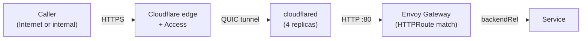

# Platform Architecture

The cluster infrastructure: the pieces every service depends on. Current as of 9156d86 (2026-08-22).

---

## 1. Ingress and traffic

External traffic enters through a Cloudflare Tunnel (a persistent outbound connection from the cluster to Cloudflare's edge), reaches the Envoy Gateway proxy data plane, and routes to services via Kubernetes `HTTPRoute` resources. No traffic is exposed to the internet directly (see ADR networking/001).

**Request path:**

Two ingress tiers route by audience (ADR networking/002), carried as the `ingress-tier` label on each `HTTPRoute`:

- **public**: unauthenticated routes on the public hostnames
- **trusted**: a `SecurityPolicy` validates a Cloudflare Access JWT and maps the `email` claim to `X-Auth-Email` (`cf-ingress-library/templates/_security-policy.tpl`). A few routes use an authentik OIDC policy instead of Cloudflare Access

All converge on the same Envoy instance. The ingress library (`cf-ingress-library/`) provides shared `HTTPRoute` templates that services import rather than hand-rolling. Services define their routes in `deploy/values.yaml` and ArgoCD renders them (see `projects/platform/cloudflare-gateway/application.yaml`).

(see: `projects/platform/cloudflare-gateway/`, `projects/platform/cf-ingress-library/`, ADR networking/001, ADR networking/002)

**Why.** The former operator reimplemented routing primitives while production
still used a separate static tunnel configuration, so Envoy Gateway took over
in-cluster routing and the operator scope narrowed to edge lifecycle (ADR
networking/001). Per-service hostnames were rejected because every service added
manual DNS and optional SSO configuration; audience tiers make private exposure
the default and public exposure explicit (ADR networking/002). The shared gateway
accepts path-conflict risk and makes route-overlap checks part of CI.

---

## 2. Network and CNI

Cilium replaced Linkerd's sidecar mesh (ADR platform/012). It runs as the cluster CNI with eBPF-accelerated L3/L4/L7 policy enforcement and transparent WireGuard encryption.

**Capabilities enabled:**

- **WireGuard encryption**: pod-to-pod traffic is encrypted on the wire via `cilium_wg0` (see: `projects/platform/cilium/values.yaml` l.53-55). `nodeEncryption: true` is set at l.56, but three of the four agents report `NodeEncryption: OptedOut`, so host-level node-to-node encryption is not in force cluster-wide. Read the live state with `cilium-dbg status`, never the values key.
- **Network policy**: Kubernetes `NetworkPolicy` and `CiliumNetworkPolicy` enforcement, `enable-policy = default` (allow-until-selected, no deny-gap at cutover, l.58)
- **Hubble observability**: flow logs and metrics from the eBPF datapath, with mTLS cert rotation via cert-manager (l.63-99)
- **kube-proxy replacement**: kubeProxyReplacement=true, so CNI directly implements service load balancing and addresses k3s's local loopback APIserver endpoint (l.7-36)

Future (ADR networking/003): L7 (HTTP/gRPC) policy, which would gate L7 metrics in Hubble. Infrastructure is ready; `CiliumNetworkPolicy` with Envoy rules not yet deployed.

(see: `projects/platform/cilium/values.yaml`, ADR platform/012, ADR networking/003)

**Why.** Linkerd sidecars prevented ordinary network policy in meshed namespaces,
kept Jobs alive, and added a container and hop to every pod (ADR platform/012).
Keeping Linkerd over Cilium was rejected because it preserves the policy blind
spot and doubles data-plane complexity; enabling every Cilium capability in one
cutover was rejected because default-deny and L7 proxying carry separate blast
radii (ADR platform/012, ADR networking/003). Cilium therefore replaces the mesh
incrementally, accepting label-derived authorization in place of per-connection
workload identity and added latency only on selected L7 surfaces.

---

## 3. GitOps and delivery

**ArgoCD** is the control plane. Every service and platform component is an `Application` CR discovered through `projects/home-cluster/kustomization.yaml`, which is auto-generated from the set of deployed services. ArgoCD watches the repo and reconciles the cluster to match Git state.

**Service tier chart versioning is decoupled from merge.** On merge to main, CI computes the next semver from conventional commits, builds and publishes the chart to OCI (`ghcr.io/jomcgi/homelab/charts`), and writes `targetRevision` back to `deploy/application.yaml` on the main branch (ADR platform/009). PRs never touch chart versions, which eliminates rebase conflicts on concurrent PRs and unblocks GitHub's native merge queue. The write-back lands within minutes of merge.

**Platform tier components** are deployed differently: every `projects/platform/*/application.yaml` tracks `targetRevision: HEAD` or `targetRevision: main` from git, with no OCI chart version at all. This means platform components deploy the instant a merge lands, without a chart-version write-back step. The service tier (monolith, embervm, inference, etc.) uses OCI charts with versions; the platform tier (CNI, cert-manager, observability) deploys templates directly from git HEAD.

**Kargo promotion pipeline** owns the monolith and embervm (ADR platform/009 decision 3). The pipeline is `dev` then `prod`, both pinned to the same OCI chart but at different versions. When a new chart publishes, the Warehouse detects it and creates Freight; dev's Promotion advances to the new version and asserts that the Application becomes Synced and Healthy. Prod's Promotion additionally requires dev to have held the Freight for a soak window (2 minutes for the monolith, 5 for embervm), which catches a rollout that comes up Healthy and then crashloops. It is explicitly not long enough for a slower-onset regression, and nothing functional beyond the readiness probe is asserted.

For all other services: ArgoCD deploys from the git-written `targetRevision` on merge, with no soak gate. The monolith and embervm are the only services promoted through Kargo because they carry the largest blast radius (almost all other services run inside the monolith).

**Kargo patches on the live Applications**, so "what version is production on" is a `kubectl` question. The root `canada` Application carries an `ignoreDifferences` entry per promoted Application plus `RespectIgnoreDifferences=true`; without the sync option a sync stamps the git value back, and the symptom is a promotion that holds for hours and then silently reverts. The CI write-back still maintains production's copy in git on purpose. It is the revert lever: dropping the `ignoreDifferences` entry hands production back to a correct value with nothing to reconstruct. Dev's file is frozen at its bootstrap floor and drifts further with every publish, by design.

(see: `projects/home-cluster/kustomization.yaml`, `projects/platform/kargo/README.md`, ADR platform/009, ADR platform/011, ADR platform/014)

**Why.** Branch-side chart bumps caused duplicate versions, merge conflicts, and
merged changes that never deployed when a bump was lost (ADR platform/009, ADR
platform/011). Floating OCI revisions were rejected because ArgoCD cannot follow
OCI semver ranges, while a production-only Kargo stage was rejected because it
adds a controller without a validation stage. Post-merge idempotent publishing
and monotonic write-back remove PR contention, and Kargo promotion accepts live
Application state as the deployed version plus a soak gate that proves readiness
only (ADR platform/009). ADR platform/014's custom merge reconciler was
superseded by the native queue; its reasoning about concurrent branches becoming
stale after every merge still holds.

---

## 4. Storage

**Longhorn** provides distributed block storage for `PersistentVolume`s. Single-replica by default (one copy per volume, no cross-node replication). GPU workloads get a separate StorageClass (`longhorn-gpu`) pinned to the GPU node with strict-local data colocation and fast NVMe.

The cluster has no S3 backup target for Longhorn volumes today. Durability rests on the single replica plus whatever out-of-band export individual services do (see: `projects/platform/longhorn/README.md`).

(see: `projects/platform/longhorn/`, `projects/platform/longhorn/README.md`)

**SeaweedFS** is S3-compatible distributed object storage (deprecated, awaiting decommission). **Cloudflare R2** now serves blob storage for the app (artifacts, images, chat attachments). Global replication policy was single-copy (`replicationPlacement: "000"`, see: `projects/platform/seaweedfs/values.yaml` l.36). The volume servers' own Longhorn PVCs provided redundancy (two replicas on the primary storage node, one on the GPU node by design). The master was single-replica and lived on Longhorn.

EmberVM uses SeaweedFS to archive task results, session state, and banked snapshots. The ember buckets are authenticated: only the `embervm` identity holds read and write on them, with credentials delivered as an `OnePasswordItem` (see: `projects/platform/seaweedfs/values.yaml` l.175-182, #4708). Every other bucket carries an anonymous identity with read and write, so SigV4 covers the ember keyspace rather than the store as a whole.

**Bucket provisioning via COSI** (ADR platform/007) is accepted but not deployed. Dynamic bucket provisioning via `BucketClaim` CRs does not exist; buckets are hand-created today. Tracked at #3888.

(see: `projects/platform/seaweedfs/`, `projects/platform/seaweedfs/values.yaml`, ADR platform/007)

**CloudNativePG** provides Postgres. Four `Cluster` CRs run today (monolith, monolith-dev, authentik, context-forge); the monolith's is the only two-instance one. The monolith cluster hosts EmberVM's op-log as a second database on the same cluster (see: `projects/embervm/deploy/values.yaml` l.44-59). Storage is a Longhorn PVC with no separate WAL volume, and a daily `ScheduledBackup` ships to SeaweedFS S3.

(see: `projects/platform/cloudnative-pg/`)

**atlas-operator** applies each service's database migrations from its ConfigMap, owned by the Atlas schema-management operator. The ConfigMap carries the entire migration history, and ArgoCD applies it as a single object with a 256 KiB last-applied-configuration annotation ceiling (see: `.claude/CLAUDE.md`).

(see: `projects/platform/atlas-operator/`)

**Why.** Imperative bucket Jobs had no teardown, separate lifecycle setup, and no
per-application credentials, leaving derived data behind after its application
was removed (ADR platform/007). Application self-provisioning was rejected because
it remains invisible to GitOps and still has no deletion path; Crossplane was
rejected as too much infrastructure for bucket provisioning alone. COSI was
chosen for declarative ownership and reclaim policy, accepting beta APIs and a
community driver; the decision remains accepted and undeployed.

---

## 5. Scheduling and capacity

**Priority classes** rank workloads under memory oversubscription (ADR platform/010). `homelab-critical` (priority 100000) and `homelab-disposable` (priority -1000, `preemptionPolicy: Never`) are live; guest workloads (EmberVM bricks) get the disposable class, so they are the first OOM victim when the node is under pressure. The cluster runs Burstable QoS: memory request==limit (reserved), CPU request-only (allowed to burst).

**Node-traffic-shaper** caps inbound bandwidth on the AI node's uplink with the CAKE qdisc so a model-weight pull cannot starve latency-sensitive control-plane traffic. It is a node-local systemd unit installed by hand, deliberately not a chart: only that node pulls large images. The other three nodes are unshaped.

**KEDA** is installed with its CRDs and control plane only. No `ScaledObject` or `ScaledJob` exists in this repo or in the cluster, so nothing autoscales on it today (see: `projects/platform/keda/values.yaml` l.1-5).

**GPU operator** manages the Nvidia driver and device plugin configuration for amd64-only inference nodes. One RTX 4090 on a single node.

(see: `projects/platform/priority-classes/`, ADR platform/010, `projects/platform/node-traffic-shaper/`, `projects/platform/keda/`, `projects/platform/nvidia-gpu-operator/`)

**Why.** Measured memory peaks left little safe request headroom to trim, while
rare peaks occurred at different times and held capacity idle between them (ADR
platform/010). Guaranteed request-equals-limit sizing was rejected because it
prevented the Firecracker tier from fitting, and BestEffort sizing was rejected
because critical workloads would lose their reserved floor. Burstable requests
plus priority classes accept an occasional OOM bet and designate reconstructible
guest work as the first victim when peaks coincide.

---

## 6. Observability

**otel-collector** runs one OpenTelemetry Collector Deployment and exports to Honeycomb. Its production metrics pipeline accepts the `http_check` receiver only. The receiver probes `https://jomcgi.dev/health` and `https://jomcgi.dev/`.

Trace admission is deny-by-default. `allowedServices` is empty, so the rendered collector has no `otlp` receiver, no traces pipeline, and no OTLP ports. Adding an exact `service.name` to the list is a one-line production values edit. Arbitrary OTLP metrics remain disabled when traces are enabled.

UptimeRobot checks `https://jomcgi.dev/health/otel-collector` through a direct public `HTTPRoute` to the collector's `health_check` extension. The route does not proxy through the public frontend.

Kyverno's cluster-wide OTel environment-variable injection is disabled. The OpenTelemetry Operator remains installed, but production renders no Python, Node.js, or Go `Instrumentation` resources and configures no endpoint.

**Internal observability guidance** lives in `docs/observability.md` (not published externally).

(see: `projects/platform/otel-collector/`, `projects/platform/opentelemetry-operator/`, `projects/platform/kyverno/values.yaml`, `docs/observability.md`)

**Why.** Honeycomb quota sets the collector's admission boundary. An empty
allowlist removes the OTLP listeners instead of relying on workloads not to send.
The metrics pipeline cannot accept arbitrary OTLP metrics.

---

## 7. Security and policy

**Kyverno** renders two cluster policies in production (`projects/platform/kyverno/templates/`):

- `require-resource-requests` checks first-party namespaces for CPU and memory requests plus a memory limit. `validationFailureAction: Audit`, so violations surface as PolicyReports and nothing is rejected
- `clone-monolith-workflows-secrets` copies the Secrets used by Argo CronWorkflow jobs into `monolith-workflows`

The `inject-otel-env-vars` template is disabled. It renders no OTel configuration or cluster policy.

Non-root execution and dropped capabilities come from each chart's own `securityContext`, and network policy is authored per service as `CiliumNetworkPolicy`.

(see: `projects/platform/kyverno/`, deployed policies in `templates/`)

**cert-manager** issues TLS certificates. The Cilium Hubble flow logs use cert-manager-issued mTLS certificates with auto-rotation, rather than Helm-generated certs that never rotate (see: `projects/platform/cilium/values.yaml` l.81-83).

**Authentik** is the in-cluster identity provider. It issues OIDC to the Envoy Gateway `SecurityPolicy` lanes (dev, the MCP preview, moving) and to Kargo's API, and enforces MFA on the accounts that reach them (`projects/platform/authentik/blueprints/`). Declarative config is blueprints applied by the worker; authentik ships no CRDs. Cloudflare Access is a separate gate on the trusted tier, and it also fronts authentik's admin console. Authentik's own credentials live in the `authentik-secrets` and `authentik-pg-app` Secrets, and each application's OIDC client secret arrives as an `OnePasswordItem`.

**1Password Operator** syncs external credentials from 1Password via `OnePasswordItem` CRs. Nothing external is hand-created. Secrets generated inside the cluster (CloudNativePG database credentials, cert-manager leaf certificates) are owned by their operators.

(see: `projects/platform/cert-manager/`, `projects/platform/authentik/`, `projects/platform/`)

**Why.** The sidecar mesh blocked native network policy and carried recurring
lifecycle failures, so Cilium consolidated CNI, encryption, and label-based
policy in one node data plane (ADR platform/012). Running both meshes was rejected
because it retains the original failure modes, and immediate Cilium mutual
authentication was deferred because its newer identity feature was outside the
cluster threat requirement. For application identity, Kubernetes-only
TokenReview was rejected because it lacks browser SSO, device flow, and human
lifecycle; provider-neutral local token verification accepts expiry-bounded
revocation and identity-provider outages for new login (ADR embervm/032).

---

## 8. Maintenance automation

**Argo Workflows** runs in the `monolith-workflows` namespace as the CronWorkflow executor. It is the runtime for Renovate and apko lock maintenance (below).

(see: `projects/platform/argo-workflows/`)

**Renovate** runs daily at 04:00 as an Argo `CronWorkflow` in `monolith-workflows` (`projects/platform/renovate/values.yaml` l.7). Its enabled managers cover Bazel modules, Go, pep621, npm/pnpm, Helm, Kubernetes manifests and ArgoCD `application.yaml` files. `renovate.json` holds ordinary PR creation to a Monday window, so the daily run exists to absorb a transient failure rather than to open PRs seven days a week. Credentials come from 1Password.

**apko lock maintenance** is a second CronWorkflow, weekly on Monday at 01:00. It regenerates every committed `apko.lock.json` on Linux through the pinned `rules_apko` toolchain, runs the committed-artifact generators, and maintains one `renovate/apko-lock-maintenance` PR under rebase auto-merge (see: `projects/platform/renovate/values.yaml` l.31, `README.md`).

**coredns** provides cluster DNS configuration for the K3s nodes.

**seaweedfs-node4** and **seaweedfs-node4b** are additional SeaweedFS volume server instances pinned to the GPU node, handling overflow storage.

(see: `projects/platform/renovate/`, `projects/platform/renovate/README.md`, `projects/platform/coredns/`, `projects/platform/seaweedfs-node4/`, `projects/platform/seaweedfs-node4b/`)

**Why.** Dependency and lock regeneration must run on Linux with pinned tooling,
survive a workstation being offline, and leave a reviewable pull request rather
than mutating the cluster directly. Argo CronWorkflows were chosen over
in-process loops and local cron because the existing controller already owns
cadence, deadlines, concurrency, and history. Daily Renovate retries are kept
separate from the Monday review window, while the weekly apko job amortizes a
more expensive whole-repository lock refresh. This accepts Argo as an operational
dependency and keeps its write credentials scoped through 1Password.

---

## ADR map

Rationale only; these ADRs record decisions, not current state. This document carries what shipped.

| Decision | ADR | Status | Notes |
|---|---|---|---|
| Obsidian vault migration into the monolith | platform/001 | Superseded by 006 | Storage decision for notes; the vault was decommissioned. |
| CDN-cached data fetching for public routes | platform/002 | Superseded by 003 | |
| CDN cache rule scoped to the public hostname | platform/003 | Implemented | Cloudflare-side cache rule; no cluster infrastructure. |
| Iceberg-on-SeaweedFS lakehouse | platform/004 | Superseded | Lakehouse and Temporal stack decommissioned 2026-06-14 (PR #2596). |
| Per-PR preview environments for the monolith | platform/005 | Draft, not built | Its data-plane primitives were reused by 009 decision 4. |
| Decommission Obsidian, Postgres as the body of record | platform/006 | Accepted, shipped | |
| SeaweedFS bucket provisioning via COSI | platform/007 | Accepted, not deployed | No COSI CRDs or `BucketClaim` in the cluster; buckets are hand-created. Tracked at #3888. |
| Monolith module boundaries | platform/008 | Accepted | Service architecture; harvested by the monolith rollup. |
| Post-merge chart versioning and Kargo promotion | platform/009 | Accepted, shipped in part | Decisions 1 and 2 shipped as specified (CI computes the version post-merge and writes it back). Decision 3 shipped via `argocd-update` against the live Application rather than a git commit. Decision 4's data plane arrived by another route. No verification gate exists; Argo Rollouts is not installed. Tracked at #4745. |
| Memory oversubscription via Burstable QoS and PriorityClass | platform/010 | Accepted, shipped | `homelab-critical` (100000) and `homelab-disposable` (-1000, `preemptionPolicy: Never`) are live. |
| Idempotent chart publish with missed-bump detection | platform/011 | Accepted, shipped | |
| Cilium replaces Linkerd | platform/012 | Accepted, shipped | Cilium is the CNI; Linkerd removed. |
| Design system contract with distinct themes | platform/013 | Accepted | Design system; harvested elsewhere. |
| Stateless merge-queue reconciler | platform/014 | Accepted, superseded by the native queue | GitHub's merge queue is now active on the default-branch ruleset (rebase, HEADGREEN). The DBOS reconciler (#4915) is not implemented, and `ready-to-merge` has no consumer in this repo. |
| Cloudflare tunnel plus Envoy Gateway | networking/001 | Implemented | |
| Path-based ingress tiers with automatic DNS | networking/002 | Implemented | Two tiers live, labelled `public` and `trusted`. |
| Incremental Cilium capability adoption | networking/003 | Accepted, partly shipped | kube-proxy replacement and WireGuard are on. No L7 `CiliumNetworkPolicy` exists, so `hubble_httpv2_requests_total` emits nothing and the `hubble-invoke-http-5xx` alert is inert. |

---

## Out of scope

These are not platform decisions: enterprise multicloud deployments, supply-chain governance, legacy migration. The platform is the cluster infrastructure. Everything else owns its own choices.
