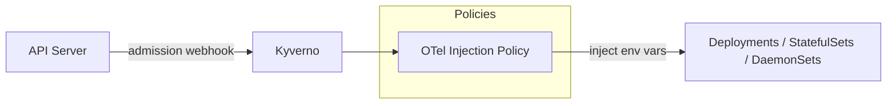

# Kyverno

Policy engine for Kubernetes with custom ClusterPolicies for automated observability.

## Overview

Kyverno acts as a Kubernetes admission controller that mutates resources to enforce cluster-wide conventions. This chart wraps the upstream Kyverno chart and adds custom ClusterPolicies that automatically inject OpenTelemetry configuration.

## Architecture

The chart deploys four Kyverno controllers plus four custom ClusterPolicies:

- **Admission Controller** - Intercepts API server requests to mutate and validate resources against policies
- **Background Controller** - Applies policies retroactively to existing resources (not just new ones)
- **Cleanup Controller** - Manages lifecycle of policy reports
- **Reports Controller** - Generates policy compliance reports

Custom policies included:

- **OTel Injection** (`inject-otel-env-vars`) - Mutates Deployments, StatefulSets, and DaemonSets to inject `OTEL_EXPORTER_OTLP_ENDPOINT` and `OTEL_EXPORTER_OTLP_PROTOCOL` environment variables
- **Require Resource Requests** (`require-resource-requests`) - Audits workloads for missing CPU/memory resource requests
- **Clone Monolith Workflow Secrets** (`clone-monolith-workflows-secrets`) - Clones the monolith Postgres app secret and the other job-pod Secrets into `monolith-workflows`, triggered on each source Secret so a recreated source is re-cloned
- **Clone SigNoz API Key** (`clone-signoz-api-key`) - Replicates the SigNoz `signoz-api-key` secret from the `signoz` namespace into the namespaces that call the SigNoz API

## Key Features

- **Cluster-wide observability** - All workloads automatically get OTel configuration
- **Opt-out model** - Label with `otel.instrumentation: disabled` to exclude
- **Background enforcement** - Policies apply to both existing and new resources
- **Audit mode** - Policies use `validationFailureAction: Audit` (non-blocking)
- **Policy exceptions** - Supports Kyverno PolicyExceptions for fine-grained overrides

## Configuration

| Value                                       | Description                                | Default                                               |
| ------------------------------------------- | ------------------------------------------ | ----------------------------------------------------- |
| `otelInjection.enabled`                     | Enable OTel env var injection policy       | `true`                                                |
| `otelInjection.endpoint`                    | OTel collector endpoint                    | `""`                                                  |
| `otelInjection.protocol`                    | OTel exporter protocol                     | `grpc`                                                |
| `otelInjection.targetKinds`                 | Resource kinds to inject into              | `[Deployment, StatefulSet, DaemonSet]`                |
| `kyverno.admissionController.replicas`      | Admission controller replicas              | `1`                                                   |
| `kyverno.features.policyExceptions.enabled` | Enable PolicyException CRD                 | `true`                                                |
