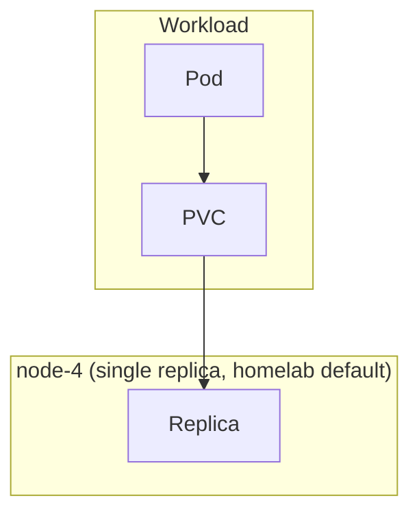

# Longhorn

Distributed block storage system for Kubernetes persistent volumes.

## Overview

Longhorn provides cloud-native distributed block storage with built-in replication, snapshots, and backups. It transforms locally-attached storage on Kubernetes nodes into a highly available distributed storage system.



## Key Features

Longhorn as software supports the following; which of these are actually turned
on in this cluster is covered in Replica Configuration below (short version:
replication and S3 backup are not).

- **Distributed replication** - Data can be replicated across nodes for high availability
- **Automatic recovery** - Self-healing from node failures, rebuilds replicas on healthy nodes
- **Backup/restore** - S3-compatible backup targets for disaster recovery
- **Snapshots** - Point-in-time volume snapshots with instant restore
- **Volume resize** - Expand PVCs without downtime
- **ReadWriteMany** - RWX volumes via NFS for multi-pod access

## Replica Configuration

**homelab production default: 1 replica** (`values-prod.yaml` `defaultReplicaCount: 1`).
Because the cluster runs single-replica by default, most volumes have no
node-loss tolerance: there is no second copy to fail over to. No S3
`backupTarget` is configured either (see the Configuration table below), so
durability currently rests entirely on the single replica plus whatever
out-of-band export a given service does for its own data.

The one exception is GPU workload storage: `storageclass-gpu.yaml` defines a
real `longhorn-gpu` StorageClass, pinned to node-4 (`nodeSelector:
"kubernetes.io/hostname:node-4"`, `diskSelector: "nvme,gpu"`) with
`numberOfReplicas: "1"` and `dataLocality: "strict-local"`, used for
performance rather than availability since GPU workloads only ever run on
node-4 anyway.

For the full range of replication trade-offs Longhorn supports (1 vs. 2 vs. 3
replicas, rebuild behavior, node-loss tolerance), see the [upstream Longhorn
volumes-and-nodes docs](https://longhorn.io/docs/latest/volumes-and-nodes/).

## Storage Classes

The default `longhorn` StorageClass is created by the upstream chart with
`numberOfReplicas` set from `defaultSettings.defaultReplicaCount` (`1` in this
cluster, see above), not the Longhorn upstream default of `3`:

```bash
kubectl get storageclass longhorn -o yaml
```

The only custom StorageClass in this repo is `longhorn-gpu`
(`storageclass-gpu.yaml`), described above. For creating additional custom
StorageClasses (disk/node selectors, data locality, reclaim policy), see the
[upstream StorageClass parameters
reference](https://longhorn.io/docs/latest/references/storage-class-parameters/).

## Volume Operations

### Expand Volume

1. Edit PVC:

   ```bash
   kubectl patch pvc postgres-data -p '{"spec":{"resources":{"requests":{"storage":"50Gi"}}}}'
   ```

2. Verify expansion:
   ```bash
   kubectl get pvc postgres-data
   ```

No pod restart required (online expansion).

### Create Snapshot

```yaml
apiVersion: snapshot.storage.k8s.io/v1
kind: VolumeSnapshot
metadata:
  name: postgres-snapshot-20260203
spec:
  volumeSnapshotClassName: longhorn
  source:
    persistentVolumeClaimName: postgres-data
```

### Clone Volume

```yaml
apiVersion: v1
kind: PersistentVolumeClaim
metadata:
  name: postgres-clone
spec:
  accessModes: [ReadWriteOnce]
  storageClassName: longhorn
  dataSource:
    kind: VolumeSnapshot
    apiGroup: snapshot.storage.k8s.io
    name: postgres-snapshot-20260203
  resources:
    requests:
      storage: 20Gi
```

## Monitoring

### Check Volume Health

```bash
kubectl -n longhorn get volumes
```

**Volume states:**

- `attached` - Mounted to a pod
- `detached` - Not in use
- `degraded` - Missing replicas (rebuilding)
- `faulted` - Critical error, data may be lost

### Replica Status

```bash
kubectl -n longhorn get replicas
```

**Replica states:**

- `running` - Healthy
- `rebuilding` - Recovering from failure
- `error` - Failed, needs attention

### Check Backup Status

```bash
kubectl -n longhorn get backupvolumes
kubectl -n longhorn get backups
```

## Orphaned iSCSI session reconciliation

`reconcile_orphaned_iscsi.py` is an operator-run safety tool for finding local
iSCSI sessions whose exact Longhorn volume name is absent from a complete,
current Longhorn volume inventory. It is a dry-run unless `--apply` is supplied.
It is intentionally not deployed as a privileged CronJob or DaemonSet.

This tool is preventive. It does not clear the historically wedged node-1
session described in issue #4170, perform a drain or reboot, or verify current
production state. A wedged kernel session can reject the targeted logout and
must be handled manually in a separately approved maintenance window.

### Safety contract

The reconciler:

- requires an explicit kubectl context and node name, checks the local short
  hostname, and verifies that exact node object in the selected cluster;
- accepts only strictly parsed `tcp` iSCSI sessions and the exact
  `iqn.2019-10.io.longhorn:<volume>` target form;
- reads the Longhorn v1beta2 API directly so kubectl preserves the server's
  list metadata, then requires an unpaginated `VolumeList` with a resource
  version and validates every item before treating any volume as absent;
- treats volumes with a deletion timestamp as present until Kubernetes removes
  them from the inventory, so live and deleting volumes remain protected;
- refuses an empty volume inventory by default. `--allow-empty-inventory`
  requires two consecutive complete empty reads and should be used only after
  an independent check confirms that the selected cluster truly has no
  Longhorn volumes;
- inspects attached devices, their descendants, mounts, swap use, sysfs
  holders, and open users before considering a session safe;
- rechecks device use, volume absence, and the unchanged session ID, target,
  and portal immediately before each single-session logout;
- never performs a blanket logout, removes a SCSI device or node record,
  restarts a service, drains a node, or triggers a reboot;
- gives every subprocess a deadline, streams audit records before host
  mutation, never retries logout, and holds a nonblocking host lock so
  overlapping runs fail safely; and
- exits nonzero and prints `MANUAL` or `FATAL` for ambiguous, failed, timed out,
  or still-present sessions. Repeated operator runs do not turn such failures
  into an unbounded retry loop.

There is still an unavoidable host-state race between observation and logout.
Run the tool only during a quiet storage maintenance period after confirming no
workload is about to attach or mount a candidate volume.

### Prerequisites and context selection

Run from a trusted checkout on the node being inspected. The host needs Python
3, `kubectl`, `iscsiadm` from open-iscsi, `lsblk` and `swapon` from util-linux
2.37 or newer, and `fuser` from psmisc. The util-linux minimum is required for
the JSON `MOUNTPOINTS` column. On each node, confirm `lsblk --version` meets the
minimum and confirm that `fuser -- /dev/KNOWN_UNUSED_BLOCK_DEVICE` exits 1 with
no stdout or stderr before apply. The operator needs root access for local
iSCSI inspection and logout, plus Kubernetes permission to get the selected
node and list `volumes.longhorn.io` in `longhorn`.

Choose and verify the context and node before every run:

```bash
kubectl config get-contexts
hostname --short
kubectl --context <home-cluster-context> get node <node-name>
kubectl --context <home-cluster-context> --namespace longhorn \
  get volumes.longhorn.io
```

Do not infer the context from the current-context marker. Pass the intended
context explicitly. Preserve an explicit `KUBECONFIG` when elevating if root
does not use the operator's kubeconfig.

### Dry-run and apply

Start with dry-run on one Longhorn node at a time:

```bash
sudo --preserve-env=KUBECONFIG python3 \
  projects/platform/longhorn/reconcile_orphaned_iscsi.py \
  --context <home-cluster-context> \
  --node <node-name>
```

Review every `CANDIDATE`, `PROTECTED`, and `IGNORED` line. Resolve every
`MANUAL` or `FATAL` result before considering apply. Then use explicit apply on
that same node and context:

```bash
sudo --preserve-env=KUBECONFIG python3 \
  projects/platform/longhorn/reconcile_orphaned_iscsi.py \
  --context <home-cluster-context> \
  --node <node-name> \
  --apply
```

Apply still refetches the complete inventory and revalidates each candidate.
It can therefore protect or skip a session that appeared in dry-run output.
The default command deadline is 15 seconds and can be set from 1 through 60
seconds with `--timeout-seconds`. A failed or timed-out logout is attempted
once, reported for manual handling, and never escalated to a broader action.

For periodic operator use, run dry-run during the regular storage review on
each enrolled Longhorn node, serially. A weekly cadence is a reasonable
starting point. Capture the output and alert on `CANDIDATE`, `MANUAL`, or
`FATAL`. An operator should review current workload and Longhorn state before a
separate `--apply` invocation. If a scheduler is used for visibility, schedule
dry-run only. Do not schedule unattended apply.

### Separate node-1 maintenance

Joe's node-1 maintenance remains a separate operation. Before scheduling it,
check present production state, confirm all etcd members and control-plane
nodes are healthy, and confirm quorum will survive one member being offline.
Drain and reboot node-1 only in Joe's selected window. Never drain or reboot
another control-plane node at the same time. Do not use this reconciler, a
service restart, SCSI deletion, or repeated logout as a fallback for the
historically wedged session.

## Troubleshooting

### Volume Stuck in "Attaching"

**Symptom:** Pod pending, volume shows "Attaching" state

**Solution:**

```bash
# Check Longhorn manager logs
kubectl -n longhorn logs deploy/longhorn-manager

# Force detach and reattach
kubectl -n longhorn annotate volume/<volume-name> \
  longhorn.io/force-detach=true
```

### Replica Rebuild Stuck

**Symptom:** Volume degraded for extended period

**Solution:**

```bash
# Check instance-manager logs
kubectl -n longhorn logs deploy/instance-manager-<node>

# Delete stuck replica
kubectl -n longhorn delete replica <replica-name>
```

### Out of Space

**Symptom:** Cannot create new volumes, "insufficient storage" error

**Solution:**

1. Check node storage:

   ```bash
   kubectl -n longhorn get nodes -o wide
   ```

2. Increase node disk size or add new nodes

3. Clean up old backups/snapshots:
   ```bash
   kubectl -n longhorn delete backups --all
   ```

## Configuration

| Value                                               | Description                 | Default  |
| --------------------------------------------------- | --------------------------- | -------- |
| `defaultSettings.backupTarget`                      | S3 bucket URL for backups   | `""`     |
| `defaultSettings.defaultReplicaCount`               | Default replica count       | `1`      |
| `defaultSettings.storageMinimalAvailablePercentage` | Min free space %            | `25`     |
| `defaultSettings.upgradeChecker`                    | Check for updates           | `true`   |
| `persistence.defaultClass`                          | Set as default StorageClass | `true`   |
| `persistence.reclaimPolicy`                         | PV reclaim policy           | `Delete` |

Full configuration: See [longhorn chart values](https://github.com/longhorn/charts/tree/master/charts/longhorn)

## Access UI

The authoritative route is the path-based private ingress:
https://private.jomcgi.dev/app/longhorn (see `templates/httproute.yaml`). A
former `longhorn.jomcgi.dev` tunnel route was retired in PR #2534.

For local access without going through the ingress:

```bash
kubectl -n longhorn port-forward svc/longhorn-frontend 8080:80
```

Navigate to http://localhost:8080

**UI Features:**

- Volume management
- Backup/restore
- Node/disk management
- Recurring job configuration
- Event logs

## Related Documentation

- [Longhorn Official Docs](https://longhorn.io/docs/)
- [Backup and Restore](https://longhorn.io/docs/latest/snapshots-and-backups/backup-and-restore/)
- [Volume Snapshots](https://longhorn.io/docs/latest/snapshots-and-backups/csi-snapshot-support/)
